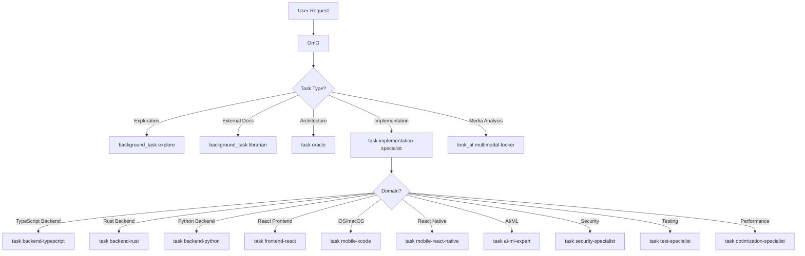

# Agent System

The OhMyOpenCode (OMO) Agent System is a sophisticated multi-model orchestration framework designed to handle complex software engineering tasks. It employs a multi-layered "Team Lead" model where a primary orchestrator manages specialized subagents through delegation hierarchies.

## Overview

The system is built on a hierarchical structure where **OmO** (the primary agent) acts as the central intelligence and project manager. Complex implementation tasks are delegated through an **Implementation Specialist** (manager) to domain-specific specialists.

### Multi-Model Strategy

By leveraging different models (Claude Opus/Sonnet, GPT-5.2, Gemini Pro, Grok-Code), the system matches the specific strengths of each model to the task at hand, balancing reasoning depth, speed, and cost.

## Agent Hierarchy (LIF-62)

```
OmO (team-lead, Claude Opus)
├── implementation-specialist (manager, Claude Sonnet)
│   │
│   │   # Language/Platform Specialists
│   ├── backend-typescript (Claude Sonnet)
│   ├── backend-rust (Claude Sonnet)
│   ├── backend-python (Claude Sonnet)
│   ├── frontend-react (Gemini Pro)
│   ├── frontend-ui-ux-engineer (Gemini Pro)
│   ├── mobile-xcode (Gemini Pro)
│   ├── mobile-react-native (Gemini Pro)
│   ├── document-writer (Gemini Pro)
│   │
│   │   # AI/ML Specialists
│   ├── ai-ml-expert (Claude Opus)
│   ├── agent-specialist (Claude Opus)
│   │
│   │   # Cross-Cutting Specialists
│   ├── security-specialist (GPT-5.2)
│   ├── test-specialist (Claude Sonnet)
│   └── optimization-specialist (Claude Sonnet)
│
├── oracle (advisor, GPT-5.2) - read-only
├── librarian (utility, Claude Sonnet) - read-only
├── explore (utility, Grok) - read-only
└── multimodal-looker (utility, Gemini Flash) - read-only
```

## Role-Based Classification

| Role | Can Delegate | Modifies Files | Governance | Examples |
|------|--------------|----------------|------------|----------|
| **team-lead** | Yes (to anyone) | Yes | Full | OmO |
| **manager** | Yes (to specialists) | Yes | Full | implementation-specialist |
| **specialist** | No (terminal) | Yes | Full | backend-typescript, frontend-react, etc. |
| **advisor** | No | No | None | oracle |
| **utility** | No | No | None | explore, librarian, multimodal-looker |

## Agent Registry

| Agent | Model | Role | Governance | Key Restrictions |
|-------|-------|------|------------|------------------|
| **OmO** | `claude-opus-4-5` | team-lead | Full | None |
| **implementation-specialist** | `claude-sonnet-4-5` | manager | Full | Cannot call OmO |
| **backend-typescript** | `claude-sonnet-4-5` | specialist | Full | Cannot delegate |
| **backend-rust** | `claude-sonnet-4-5` | specialist | Full | Cannot delegate |
| **backend-python** | `claude-sonnet-4-5` | specialist | Full | Cannot delegate |
| **frontend-react** | `gemini-3-pro` | specialist | Full | Cannot delegate |
| **frontend-ui-ux-engineer** | `gemini-3-pro` | specialist | Full | Cannot delegate |
| **mobile-xcode** | `gemini-3-pro` | specialist | Full | Cannot delegate |
| **mobile-react-native** | `gemini-3-pro` | specialist | Full | Cannot delegate |
| **document-writer** | `gemini-3-pro` | specialist | Full | Cannot delegate |
| **ai-ml-expert** | `claude-opus-4-5` | specialist | Full | Cannot delegate |
| **agent-specialist** | `claude-opus-4-5` | specialist | Full | Cannot delegate |
| **security-specialist** | `gpt-5.2` | specialist | Full | Cannot delegate |
| **test-specialist** | `claude-sonnet-4-5` | specialist | Full | Cannot delegate |
| **optimization-specialist** | `claude-sonnet-4-5` | specialist | Full | Cannot delegate |
| **oracle** | `gpt-5.2` | advisor | None | No write/edit/task |
| **librarian** | `claude-sonnet-4-5` | utility | None | No write/edit |
| **explore** | `grok-code` | utility | None | READ-ONLY |
| **multimodal-looker** | `gemini-2.5-flash` | utility | None | READ-ONLY |

## Multi-Layered Orchestration

### Delegation Flow



### Delegation Depth Limits

To prevent context explosion and infinite loops:
- **Maximum depth**: 2 levels (OmO → Manager → Specialist)
- **Specialists cannot delegate**: `task: false` in tool config
- **Managers cannot call up**: Cannot invoke OmO or other managers

### Delegation Mechanisms

- **`task()`**: Synchronous delegation where the caller waits for a result
- **`background_task()`**: Asynchronous "fire-and-forget" operations
- **`look_at()`**: Specifically for multimodal-looker to analyze media files

## Governance System

### Governance Levels

| Level | Includes | Applied To |
|-------|----------|------------|
| **full** | Path validation, changelog, Linear, spec workflow | All file-modifying agents |
| **minimal** | Path validation, changelog only | (Reserved for future use) |
| **none** | No governance injection | Read-only agents, OmO (already has governance) |

### Governance Template

File-modifying agents receive a centralized governance template (~400 tokens) that includes:

1. **Path Discipline**: File location conventions
2. **Changelog Discipline**: Automatic modification tracking
3. **Linear Integration**: Issue context and branch management
4. **Spec-Driven Workflow**: Feature folder awareness
5. **Structured Response Format**: JSON schema for handoffs

### Governance Hooks

| Hook | Trigger | Purpose |
|------|---------|---------|
| `governance-path-validator` | Before file write | Validates paths follow conventions |
| `governance-historian` | After session | Creates changelog entries |
| `governance-linear-injector` | On issue ID detection | Injects Linear context |

## Primary Orchestrator: OmO

OmO is the "Team Lead" of the system. Its behavior is governed by a complex system prompt that enforces strict operational discipline.

### Intent Gate (Phase 0)

Before any action, OmO classifies the user's intent:
- **TRIVIAL**: Direct tool usage only
- **EXPLORATION**: Assess search scope before firing agents
- **IMPLEMENTATION**: Delegate to implementation-specialist
- **ORCHESTRATION**: Break down into multi-step plans

### Todo Management

OmO is "obsessively" committed to task tracking:
- **Mandatory Todos**: Any task with 2+ steps requires `todowrite`
- **Atomic & Verifiable**: Each todo must be a single action with clear verification criteria
- **Evidence-Based**: A task is only "completed" when evidence is provided

### Blocking Gates

Strict guardrails prevent common AI errors:
- **Pre-Search**: Must try direct tools (grep/glob) before agents
- **Pre-Edit**: Must read the file in the current session before editing
- **Implementation Block**: Complex implementation MUST delegate to implementation-specialist
- **Pre-Delegation**: Must use the **7-Section Prompt Structure**
- **Pre-Completion**: All todos must be marked complete with evidence

### 7-Section Prompt Structure

All subagent delegations must follow this format:
1. **TASK**: Specific, obsessive detail
2. **EXPECTED OUTCOME**: Concrete deliverables
3. **REQUIRED SKILLS**: Specific capabilities to invoke
4. **REQUIRED TOOLS**: Explicit tool permissions
5. **MUST DO**: Exhaustive requirements
6. **MUST NOT DO**: Forbidden actions
7. **CONTEXT**: File paths and constraints

## Implementation Specialist

The Implementation Specialist acts as a delegation hub between OmO and specialized sub-agents.

### Responsibilities

1. **Task Decomposition**: Break complex tasks into domain-specific sub-tasks
2. **Specialist Selection**: Choose the right specialist for each sub-task
3. **Result Aggregation**: Combine specialist outputs into cohesive deliverables
4. **Quality Assurance**: Verify specialist work before returning to OmO

### Delegation Decision Tree

```
1. Is this AI/ML work? → ai-ml-expert
2. Is this agent/orchestration design? → agent-specialist
3. Is this security-focused? → security-specialist
4. Is this testing work? → test-specialist
5. Is this optimization work? → optimization-specialist
6. What language/platform?
   - Rust → backend-rust
   - Python → backend-python
   - TypeScript backend → backend-typescript
   - React/Next.js → frontend-react
   - Swift/iOS/macOS → mobile-xcode
   - React Native → mobile-react-native
   - Design-focused UI → frontend-ui-ux-engineer
   - Documentation → document-writer
```

## Specialized Subagents

### Advisor Agents (Read-Only)

#### Oracle (Strategic Advisor)
The "Senior Engineering Advisor" used for high-level design, architecture reviews, and complex debugging. It has high reasoning effort but is restricted from modifying files.

### Utility Agents (Read-Only)

#### Explore (Contextual Grep)
Optimized for internal codebase search. OmO fires multiple Explore agents in parallel to map out unknown architectures quickly.

#### Librarian (External Researcher)
Specializes in external documentation, GitHub repository analysis, and open-source reference implementations.

#### Multimodal Looker (Media Analyst)
Analyzes non-text files like PDFs, images, and diagrams.

### Language/Platform Specialists

| Specialist | Model | Domain |
|------------|-------|--------|
| backend-typescript | Claude Sonnet | TypeScript/Node.js APIs, services, database |
| backend-rust | Claude Sonnet | Rust systems programming, Actix-web/Axum |
| backend-python | Claude Sonnet | Python/FastAPI/Django/Flask |
| frontend-react | Gemini Pro | React/Next.js components, hooks, state |
| frontend-ui-ux-engineer | Gemini Pro | Design-focused UI, aesthetics |
| mobile-xcode | Gemini Pro | iOS/macOS, Swift/SwiftUI |
| mobile-react-native | Gemini Pro | Cross-platform mobile |
| document-writer | Gemini Pro | Technical documentation |

### AI/ML Specialists

| Specialist | Model | Domain |
|------------|-------|--------|
| ai-ml-expert | Claude Opus | RAG, DSPy, Agno, LLM integration |
| agent-specialist | Claude Opus | Multi-agent design, OMO extensions |

### Cross-Cutting Specialists

| Specialist | Model | Domain |
|------------|-------|--------|
| security-specialist | GPT-5.2 | OWASP, vulnerability analysis |
| test-specialist | Claude Sonnet | Unit/integration/e2e testing |
| optimization-specialist | Claude Sonnet | Performance profiling |

### Workflow Specialists (LIF-72)

| Specialist | Model | Domain |
|------------|-------|--------|
| product-strategist | Claude Sonnet | Feature specification, requirements |
| strategic-planner | Claude Sonnet | Implementation planning, architecture |
| task-planner | Claude Sonnet | Task breakdown, effort estimation |

These specialists power the workflow commands (`/specify`, `/plan`, `/tasks`) and are invoked automatically when users run those commands.

### Meta-Learning (LIF-73)

| Specialist | Model | Domain |
|------------|-------|--------|
| context-learner | Claude Opus | Session analysis, pattern extraction |

The context-learner analyzes session transcripts to extract insights for improving OmO orchestration, delegation patterns, and agent instructions.

## Agent Infrastructure

### Creation & Governance Injection

Agents are instantiated via `createBuiltinAgents()`. During creation:
1. **Injects Environment Context**: OmO and librarian receive real-time info
2. **Injects Governance Template**: File-modifying agents receive governance rules
3. **Applies Overrides**: Configuration can be customized per-project

### Configuration Overrides

Agents can be customized in `oh-my-opencode.json`:

```json
{
  "agents": {
    "overrides": {
      "oracle": {
        "model": "openai/gpt-4o",
        "temperature": 0.2
      },
      "explore": {
        "disabled": true
      }
    }
  }
}
```

## Tool Restrictions by Role

| Role | write | edit | task | background_task | bash |
|------|:-----:|:----:|:----:|:---------------:|:----:|
| team-lead | ✅ | ✅ | ✅ | ✅ | ✅ |
| manager | ✅ | ✅ | ✅ | ✅ | ✅ |
| specialist | ✅ | ✅ | ❌ | ❌ | ✅ |
| advisor | ❌ | ❌ | ❌ | ❌ | ✅ |
| utility | ❌ | ❌ | ❌ | ❌ | ✅ |

## Structured Response Format

All specialists return results in a consistent JSON format:

```json
{
  "status": "success|partial|failed",
  "summary": "Brief description of work completed",
  "files": {
    "created": ["path/to/new/file.ts"],
    "modified": ["path/to/changed/file.ts"]
  },
  "errors": ["Optional: any errors encountered"],
  "nextSteps": ["Optional: recommended follow-up actions"]
}
```

This enables predictable handoffs between agents and result aggregation by the Implementation Specialist.
