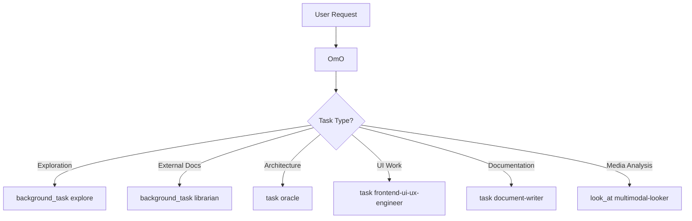

# Agent System

The OhMyOpenCode (OMO) Agent System is a sophisticated multi-model orchestration framework designed to handle complex software engineering tasks. It employs a "Team Lead" model where a primary orchestrator manages specialized subagents to ensure precision, efficiency, and high-quality output.

## Overview

The system is built on a hierarchical structure where **OmO** (the primary agent) acts as the central intelligence and project manager. Specialized tasks are delegated to subagents optimized for specific domains such as architecture, documentation, UI/UX, and codebase exploration.

### Multi-Model Strategy

By leveraging different models (Claude 3.5/4.5, GPT-5.2, Gemini 3 Pro, Grok-Code), the system matches the specific strengths of each model to the task at hand, balancing reasoning depth, speed, and cost.

## Agent Registry

| Agent | Model | Mode | Temperature | Thinking | Key Restrictions |
| :--- | :--- | :--- | :--- | :--- | :--- |
| **OmO** | `claude-opus-4-5` | Primary | - | 32K | None |
| **oracle** | `gpt-5.2` | Subagent | 0.1 | - | No write/edit/task/background_task |
| **librarian** | `claude-sonnet-4-5` | Subagent | 0.1 | - | No write/edit/background_task |
| **explore** | `grok-code` | Subagent | 0.1 | - | READ-ONLY (No write/edit/bg_task) |
| **frontend** | `gemini-3-pro` | Subagent | - | - | No background_task |
| **document-writer** | `gemini-3-pro` | Subagent | - | - | No background_task |
| **multimodal-looker** | `gemini-2.5-flash` | Subagent | 0.1 | - | No write/edit/bash/background_task |

## Agent Orchestration Patterns

The system uses different delegation patterns based on the nature of the subtask:

### Delegation Mechanisms
- **`task()`**: Used for synchronous delegation where the primary agent waits for a result (e.g., Oracle consultation, UI implementation).
- **`background_task()`**: Used for asynchronous "fire-and-forget" operations. OmO fires multiple search tasks in parallel and continues working, collecting results later via `background_output`.
- **`look_at()`**: Specifically used for the `multimodal-looker` to analyze non-text files like PDFs or images.

## Primary Orchestrator: OmO

OmO is the "Team Lead" of the system. Its behavior is governed by a complex system prompt that enforces strict operational discipline.

### Intent Gate (Phase 0)
Before any action, OmO classifies the user's intent:
- **TRIVIAL**: Direct tool usage only.
- **EXPLORATION**: Assess search scope before firing agents.
- **IMPLEMENTATION**: Identify required context.
- **ORCHESTRATION**: Break down into multi-step plans.

### Todo Management
OmO is "obsessively" committed to task tracking:
- **Mandatory Todos**: Any task with 2+ steps requires `todowrite`.
- **Atomic & Verifiable**: Each todo must be a single action with clear verification criteria.
- **Evidence-Based**: A task is only "completed" when evidence (LSP diagnostics, test results, etc.) is provided.

### Blocking Gates
Strict guardrails prevent common AI errors:
- **Pre-Search**: Must try direct tools (grep/glob) before agents.
- **Pre-Edit**: Must read the file in the current session before editing.
- **Frontend Block**: **HARD BLOCK** on editing frontend files (`.tsx`, `.css`, etc.). MUST delegate to the Frontend Engineer.
- **Pre-Delegation**: Must use the **7-Section Prompt Structure**.
- **Pre-Completion**: All todos must be marked complete with evidence.

### 7-Section Prompt Structure
All subagent delegations must follow this format:
1. **TASK**: Specific, obsessive detail.
2. **EXPECTED OUTCOME**: Concrete deliverables.
3. **REQUIRED SKILLS**: Specific capabilities to invoke.
4. **REQUIRED TOOLS**: Explicit tool permissions.
5. **MUST DO**: Exhaustive requirements.
6. **MUST NOT DO**: Forbidden actions.
7. **CONTEXT**: File paths and constraints.

## Specialized Subagents

### Oracle (Strategic Advisor)
The "Senior Engineering Advisor" used for high-level design, architecture reviews, and complex debugging. It has high reasoning effort but is restricted from modifying files to ensure it remains a pure advisor.

### Explore (Contextual Grep)
Optimized for internal codebase search. It is treated as a "semantic tool" rather than a full agent. OmO is instructed to fire multiple Explore agents in parallel to map out unknown architectures quickly.

### Librarian (External Researcher)
Specializes in external documentation, GitHub repository analysis, and open-source reference implementations. It uses `context7` for official docs and `grep_app` for global code search.

### Frontend Engineer
Handles all visual and UI-related work. It follows a "Design Thinking" approach, choosing bold aesthetic directions rather than generic "AI aesthetics."

### Document Writer
A verification-driven technical writer. It ensures all code examples in documentation are actually tested and working before marking a task as complete.

## Agent Infrastructure

### Creation & Environment Injection
Agents are instantiated via `createBuiltinAgents()`. During creation, the system:
1. **Injects Environment Context**: `OmO` and `librarian` receive real-time info (working directory, platform, current date/time) to prevent "date hallucinations" (e.g., thinking it's 2024).
2. **Applies Overrides**: Configuration can be customized per-project or per-user.

### Configuration Overrides
Agents can be customized in `oh-my-opencode.json`:

\`\`\`json
{
  "agents": {
    "overrides": {
      "oracle": {
        "model": "openai/gpt-4o",
        "temperature": 0.2
      },
      "explore": {
        "disabled": true
      }
    }
  }
}
\`\`\`

## Tool Restrictions by Agent

To maintain safety and role clarity, subagents have restricted toolsets:

| Agent | write | edit | task | background_task | bash |
| :--- | :---: | :---: | :---: | :---: | :---: |
| oracle | ❌ | ❌ | ❌ | ❌ | ✅ |
| librarian | ❌ | ❌ | - | ❌ | ✅ |
| explore | ❌ | ❌ | - | ❌ | ✅ |
| frontend | ✅ | ✅ | ✅ | ❌ | ✅ |
| document-writer | ✅ | ✅ | ✅ | ❌ | ✅ |
| multimodal-looker | ❌ | ❌ | - | ❌ | ❌ |

*(Note: `task` and `background_task` restrictions prevent recursive delegation unless explicitly allowed.)*
