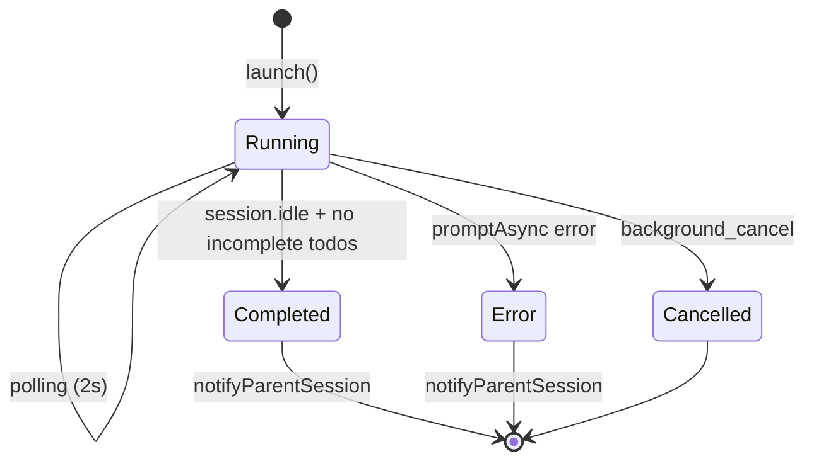

# Background Task System

The Background Task System in OhMyOpenCode (OMO) enables asynchronous agent execution, allowing long-running tasks to run in parallel without blocking the primary agent or the user interface. This is essential for complex research, large-scale code analysis, and multi-step background operations.

## Overview

The system allows an agent to "delegate" work to a child session. While the child session (running a specialized agent) performs the task, the parent session remains free to interact with the user or perform other tasks.

### Why it exists
- **Parallelism**: Maximize throughput by running multiple agents concurrently.
- **Non-blocking Workflow**: Prevent long-running tools from freezing the conversation.
- **Specialization**: Offload specific tasks to agents best suited for them (e.g., `librarian` for docs, `explore` for code).

## Architecture

The system consists of several interconnected components:

1.  **`BackgroundManager`**: The central service that manages task lifecycles, polling, and notifications.
2.  **`BackgroundTask`**: The data model representing an asynchronous operation.
3.  **Background Tools**: A set of tools (`background_task`, `background_output`, `background_cancel`) that agents use to interact with the system.
4.  **Event Hook**: A lifecycle hook that feeds OpenCode session events into the manager.
5.  **Polling Mechanism**: A background process that ensures state consistency and enriches task progress data.

## BackgroundManager Class

Located in `src/features/background-agent/manager.ts`, this class is the heart of the system.

### Initialization
The constructor initializes task and notification maps and stores the OpenCode client and working directory.

```typescript
constructor(ctx: PluginInput) {
  this.tasks = new Map();
  this.notifications = new Map();
  this.client = ctx.client;
  this.directory = ctx.directory;
}
```

### `launch(input: LaunchInput)`
Creates a new background task.
1.  **Session Creation**: Calls `client.session.create` with `parentID` set to the parent session.
2.  **Task Initialization**: Generates a unique Task ID (e.g., `bg_a1b2c3d4`) and stores metadata.
3.  **Async Prompting**: Uses `client.session.promptAsync` to start the agent. It explicitly disables `task` and `background_task` tools in the child session to prevent infinite recursion.
4.  **Polling**: Starts the 2-second polling interval if not already active.

### `handleEvent(event: Event)`
Processes real-time events from the OpenCode event stream:
-   **`message.part.updated`**: Detects tool calls in the background session to update progress metrics.
-   **`session.idle`**: Triggered when the background agent stops speaking. The manager then checks for incomplete todos before marking the task as `completed`.
-   **`session.deleted`**: If a background session is deleted, the associated task is marked as `cancelled`.

### `pollRunningTasks()`
A background loop that runs every **2 seconds** to:
1.  Fetch the status of all active sessions.
2.  Transition `idle` sessions to `completed` (after todo verification).
3.  Enrich task progress by fetching recent assistant messages and tool call counts.

### `notifyParentSession(task: BackgroundTask)`
When a task finishes, the manager:
1.  **Toast Notification**: Attempts to show a success/error toast in the TUI.
2.  **Parent Prompt**: Sends a message to the parent session: `[BACKGROUND TASK COMPLETED] Task "..." finished in ...`. This alerts the parent agent that results are ready.

### `checkSessionTodos(sessionID: string)`
Ensures a task is truly finished by checking the OpenCode todo list for the session. A task is only considered complete if the session is `idle` **and** all todos are either `completed` or `cancelled`.

## Task Lifecycle

The following state machine describes the progression of a background task:



### Task States
| State | Description |
| :--- | :--- |
| `running` | The task is active; the agent is working or there are pending todos. |
| `completed` | The agent finished successfully and all todos are cleared. |
| `error` | An execution error occurred (e.g., agent not found). |
| `cancelled` | The task was manually stopped or the session was deleted. |

## Background Tools

Agents interact with the system through three primary tools.

### 1. `background_task`
Launches an asynchronous task.
-   **Arguments**:
    -   `description`: Short name for the task.
    -   `prompt`: Detailed instructions for the background agent.
    -   `agent`: The name of the agent to invoke.
-   **Returns**: Task ID, Session ID, and initial status.

### 2. `background_output`
Retrieves status or results.
-   **Modes**:
    -   **Non-blocking (`block: false`)**: Returns a status table with duration, tool calls, and a preview of the last message.
    -   **Blocking (`block: true`)**: Waits (polls) until the task is finished or a timeout is reached, then returns the full final response.

### 3. `background_cancel`
Aborts a running task.
-   **Behavior**: Sends an `abort` signal to the background session and marks the task as `cancelled`.

## call_omo_agent Tool

The `call_omo_agent` tool is a specialized alternative for invoking agents.

| Feature | `background_task` | `call_omo_agent` |
| :--- | :--- | :--- |
| **Execution** | Always asynchronous | Sync or Async (`run_in_background` flag) |
| **Agents** | Any registered agent | Restricted to `explore` or `librarian` |
| **Continuation** | New session only | Supports `session_id` for sync continuation |
| **Output** | Requires `background_output` | Returns result directly in sync mode |

## Notification System

The system uses a dual-notification approach to ensure the user and the parent agent are aware of task completion.

1.  **TUI Toast**: A visual popup for the user.
    ```typescript
    tuiClient.tui.showToast({
      body: {
        title: "Background Task Completed",
        message: `Task "${task.description}" finished in ${duration}.`,
        variant: "success",
      },
    });
    ```
2.  **Parent Session Prompt**: An automated message injected into the parent conversation.
    ```text
    [BACKGROUND TASK COMPLETED] Task "Analyze Logs" finished in 45s. 
    Use background_output with task_id="bg_abc123" to get results.
    ```

## Code Examples

### Launching and Retrieving Results

<CodeGroup>
```typescript title="Step 1: Launch"
// Agent calls background_task
const launch = await use_tool("background_task", {
  description: "Security Audit",
  agent: "librarian",
  prompt: "Check the codebase for hardcoded API keys."
});
// Returns: "Background task launched successfully. Task ID: bg_sec_123..."
```

```typescript title="Step 2: Check Status"
// Later, check progress
const status = await use_tool("background_output", {
  task_id: "bg_sec_123"
});
// Returns a markdown table with current progress
```

```typescript title="Step 3: Get Result"
// Once notified, get the final report
const result = await use_tool("background_output", {
  task_id: "bg_sec_123",
  block: true
});
// Returns the full text output from the librarian agent
```
</CodeGroup>

## Data Structures

### `BackgroundTask` Interface
```typescript
export interface BackgroundTask {
  id: string;
  sessionID: string;
  parentSessionID: string;
  parentMessageID: string;
  description: string;
  prompt: string;
  agent: string;
  status: "running" | "completed" | "error" | "cancelled";
  startedAt: Date;
  completedAt?: Date;
  result?: string;
  error?: string;
  progress?: {
    toolCalls: number;
    lastTool?: string;
    lastUpdate: Date;
    lastMessage?: string;
    lastMessageAt?: Date;
  };
}
```
