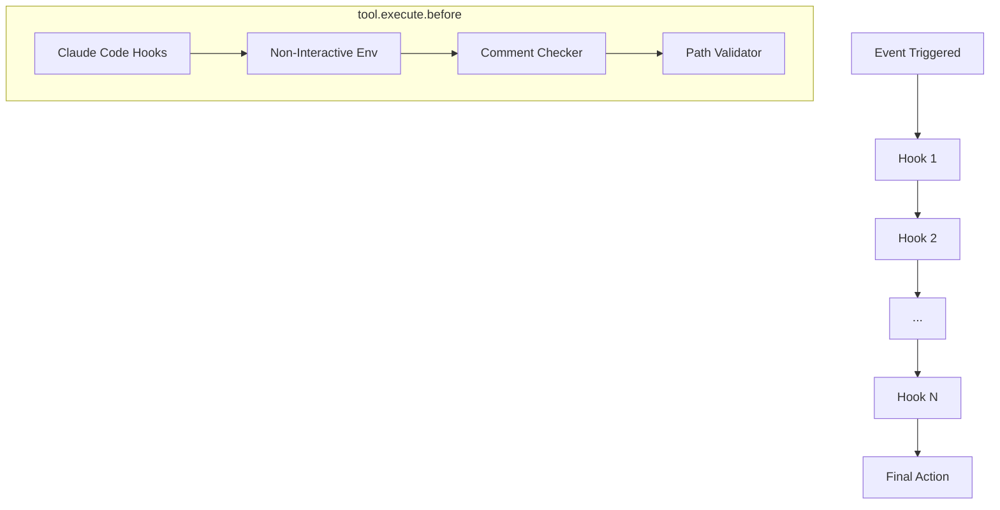

# Hook System

The OhMyOpenCode Hook System is an event-driven architecture that allows the plugin to intercept, modify, and react to various lifecycle events within the OpenCode environment. With over 20 specialized hooks, it provides features ranging from auto-recovery to governance enforcement.

## Overview

Hooks are modular components that subscribe to specific events. They are initialized with the `PluginInput` context, giving them access to the OpenCode client and the current working directory.

### Hook Creation Pattern

All hooks follow a consistent factory pattern:

```typescript
export function createXXXHook(ctx: PluginInput): HookHandlers {
  // Internal state (session-scoped)
  const sessionState = new Map<string, State>();

  return {
    "event": async (input) => { /* ... */ },
    "tool.execute.before": async (input, output) => { /* ... */ },
    "tool.execute.after": async (input, output) => { /* ... */ },
    "chat.message": async (input, output) => { /* ... */ },
  };
}
```

## Hook Lifecycle Events

The system supports several key event types:

| Event | Description |
|-------|-------------|
| `event` | Session lifecycle events: `session.created`, `session.idle`, `session.error`, `session.deleted`, `session.compacted`, `session.updated`. |
| `tool.execute.before` | Triggered before a tool is executed. Hooks can modify tool arguments or block execution by throwing an error. |
| `tool.execute.after` | Triggered after a tool completes. Hooks can modify the tool output or metadata. |
| `chat.message` | Triggered during message processing. Used for context injection and prompt modification. |
| `chat.params` | Triggered before sending a request to the model. Used to switch models or inject thinking configurations. |

## Hook Categories

The hooks are logically grouped into five categories:

| Category | Hooks | Purpose |
|----------|-------|---------|
| **Session** | `session-recovery`, `session-notification`, `todo-continuation-enforcer`, `background-notification` | Manage session state, recovery, and user notifications. |
| **Tool** | `comment-checker`, `tool-output-truncator`, `grep-output-truncator`, `rules-injector`, `directory-agents-injector`, `directory-readme-injector`, `empty-task-response-detector`, `non-interactive-env`, `interactive-bash-session` | Enhance tool behavior, manage output size, and inject context. |
| **Chat** | `claude-code-hooks`, `keyword-detector`, `agent-usage-reminder`, `think-mode`, `context-window-monitor` | Modify chat flow, inject prompts, and monitor model constraints. |
| **Utility** | `auto-update-checker`, `anthropic-auto-compact` | Maintenance tasks and automatic session optimization. |
| **Governance** | `governance-path-validator`, `governance-historian`, `governance-linear-injector` | Enforce project standards, track changes, and link to external systems. |

## Hook Chain Pattern

Hooks are executed sequentially within each event handler. This allows multiple hooks to process the same event in a specific order. For example, the `governance-path-validator` typically runs last in `tool.execute.before` to ensure all other modifications are complete before final validation.



## Hook Enable/Disable

Hooks can be selectively disabled via the `disabled_hooks` array in the configuration file (`oh-my-opencode.json`):

```json
{
  "disabled_hooks": [
    "agent-usage-reminder",
    "session-notification"
  ]
}
```

## Key Hook Deep Dives

### Todo Continuation Enforcer
Automatically prompts the AI to continue working if incomplete tasks remain in the todo list when the session becomes idle.
- **Logic**: Listens for `session.idle`, waits 200ms (debouncing), fetches todos via API, and injects a continuation prompt if pending tasks exist.
- **Safety**: Bypasses injection if the session ended in an error or was interrupted by the user.

### Session Recovery
Automatically detects and fixes common AI message structure errors.
- **Error Types**:
  - `tool_result_missing`: Injects "Operation cancelled" results for orphaned tool calls.
  - `thinking_block_order`: Fixes messages that don't start with a required thinking block.
  - `empty_content_message`: Injects placeholder text into messages with empty content fields.
- **Workflow**: `session.error` -> `session.abort()` -> Apply fix -> `session.prompt("continue")`.

### Claude Code Hooks
Provides a compatibility layer for hooks defined in the `.claude/hooks/` directory, supporting the standard Claude Code hook lifecycle:
- `PreToolUse`: Equivalent to `tool.execute.before`.
- `PostToolUse`: Equivalent to `tool.execute.after`.
- `UserPromptSubmit`: Equivalent to `chat.message`.
- `Stop`: Triggered on `session.idle`.

### Rules Injector
Injects relevant project rules into tool outputs based on the file being accessed.
- **Discovery**: Searches for `.cursorrules` or `.cursor/rules/*.mdc` files from the file's directory up to the project root.
- **Matching**: Parses frontmatter to match rules against the current file path using glob patterns.
- **Injection**: Appends the rule content to the tool output, ensuring the AI is aware of specific coding standards for that file.

<Note>
Governance hooks are documented in detail in the [Governance Documentation](/architecture/05-governance).
</Note>
