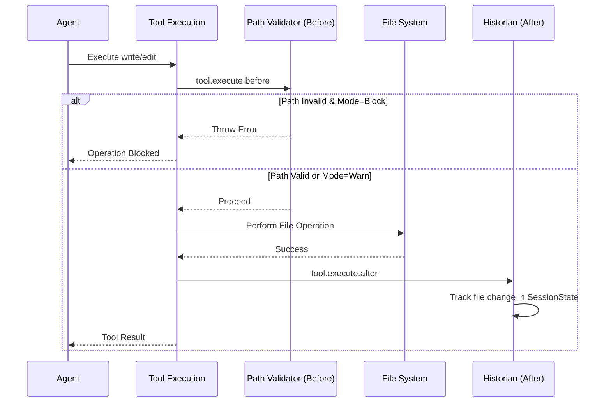
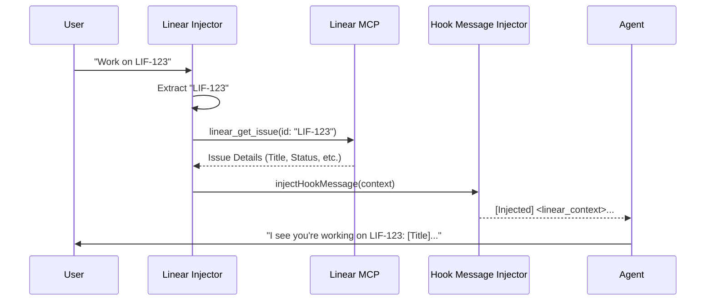

# Governance System

## Overview

The OhMyOpenCode Governance System is a suite of hooks and tools designed to enforce project structure, maintain an audit trail of changes, and integrate deeply with project management workflows (Linear). It ensures that AI agents operate within defined boundaries while providing the necessary context for high-quality contributions.

### Design Philosophy

- **Boundary Enforcement**: Prevent accidental modifications to sensitive areas or disorganized file creation.
- **Traceability**: Every change should be traceable to an agent, a session, and a project management task.
- **Contextual Awareness**: Automatically inject relevant project and task context into agent conversations.
- **Standardization**: Enforce consistent naming conventions and directory structures.

## Configuration Schema

The governance system is configured via the `governance` field in the plugin configuration, defined by the following Zod schemas in `src/config/schema.ts`:

### Path Validation (`GovernancePathValidationSchema`)

| Field | Type | Default | Description |
|-------|------|---------|-------------|
| `enabled` | boolean | `true` | Whether path validation is enabled. |
| `mode` | `warn` \| `block` \| `disabled` | `warn` | Validation enforcement level. |
| `allowed_paths` | string[] | (see below) | List of allowed path prefixes relative to project root. |

**Default Allowed Paths**:
- `context/specs/`
- `context/memory/`
- `.cursor/specs/`
- `.cursor/memory/`
- `.opencode/`
- `src/`
- `tests/`
- `docs/`
- `lib/`
- `packages/`

### Historian (`GovernanceHistorianSchema`)

| Field | Type | Default | Description |
|-------|------|---------|-------------|
| `enabled` | boolean | `true` | Whether historian tracking is enabled. |
| `auto_create` | boolean | `true` | Whether to auto-create changelog entries on session end. |
| `changelog_path` | string | `changelog/` | Path to the changelog directory. |
| `min_changes` | number | `1` | Minimum number of file changes to trigger a changelog. |

### Linear Integration (`GovernanceLinearSchema`)

| Field | Type | Default | Description |
|-------|------|---------|-------------|
| `enabled` | boolean | `true` | Whether Linear context injection is enabled. |
| `team_prefix` | string | `LIF` | Team prefix pattern for issue detection (e.g., "LIF"). |
| `cache_issues` | boolean | `true` | Whether to cache issue data per session. |

---

## Path Validation Hook

The Path Validation Hook intercepts file system operations to ensure agents are writing to appropriate locations.

### Purpose
To validate `write` and `edit` tool operations against a whitelist of allowed paths, preventing folder fragmentation and ensuring compliance with project organization rules.

### Implementation Details
- **Hook Point**: `tool.execute.before` (runs LAST in the sequence).
- **Validation Logic**:
  - Normalizes paths to be relative to the project root.
  - Checks if the path starts with any entry in `allowed_paths`.
  - **Suggestion Generation**:
    - If writing to the root level, suggests `src/`, `docs/`, or `context/specs/`.
    - If spec-related content is detected outside of spec folders, suggests `context/specs/` or `.cursor/specs/`.

### Enforcement Modes
- **`block`**: Throws an error, preventing the tool from executing. Adds `governance_blocked` metadata.
- **`warn`**: Logs a warning to the console and adds `governance_warning` metadata, but allows the operation to proceed.
- **`disabled`**: Skips all validation logic.

---

## Historian Hook

The Historian Hook maintains an audit trail of all file modifications performed by agents.

### Purpose
To track file creations and modifications during a session and automatically generate structured changelog entries.

### Session State Tracking
The hook maintains a `SessionState` for each active session:
- `modifiedFiles`: A set of paths modified via `edit` or `write` (if file existed).
- `createdFiles`: A set of paths created via `write` (if file did not exist).
- `agent`: The name of the agent performing the work.
- `startTime`: When the session began.

### Scope Inference
The historian automatically infers the "scope" of work based on the modified files using regex patterns:
- `context/specs/{scope}/` -> `{scope}`
- `src/{scope}/` -> `{scope}`
- `docs/` -> `docs-{scope}`
- `tests/` -> `testing`

### Changelog Generation
When a session ends (`session.deleted` event), if `auto_create` is enabled and the number of changes meets `min_changes`, a markdown changelog is generated.

**Filename Format**: `YYYY-MM-DD__{agent}__{scope}.md`

**Content Structure**:
- Header with Date, Agent, Scope, and Session ID.
- Summary of the work.
- List of files changed with status icons (`+` created, `~` modified, `-` deleted).

---

## Linear Injector Hook

The Linear Injector Hook bridges the gap between chat conversations and project management.

### Purpose
To automatically detect Linear issue references in chat messages and inject detailed issue context (title, status, description, branch) into the agent's prompt.

### Workflow
1. **Extraction**: Uses a regex based on `team_prefix` (e.g., `\b(LIF-\d+)\b`) to find issue identifiers in chat messages.
2. **Fetching**: Calls the `linear_get_issue` tool via the Linear MCP to retrieve full issue details.
3. **Caching**: Stores retrieved issue context in a `SessionIssueCache` to prevent redundant API calls within the same session.
4. **Injection**: Formats the issue details into a `<linear_context>` block and injects it into the conversation using the `hook-message-injector`.

### Injected Context Fields
- Identifier and Title
- Current Status
- Issue URL
- Git Branch Name
- Labels
- Parent Issue (if applicable)
- Truncated Description

---

## Governance Tools

The system provides several tools to facilitate governed workflows.

### `linear_branch`
- **Purpose**: Retrieves the canonical branch name for a Linear issue.
- **Behavior**: Attempts to fetch from Linear; if unavailable or not set, generates a slugified fallback: `feature/{issueId}-{title-slug}`.

### `linear_update_status`
- **Purpose**: Updates the status of a Linear issue and optionally adds a comment.
- **Statuses**: `todo`, `in_progress`, `in_review`, `done`, `canceled`.

### `linear_create_issue`
- **Purpose**: Creates a new Linear issue directly from the agent interface.

### `read_context`
- **Purpose**: Reads the `project-context.yaml` file.
- **Usage**: Allows agents to understand project-specific tech stacks, architecture patterns, and conventions.

### `create_spec_folder`
- **Purpose**: Initializes a standardized spec folder for a new feature.
- **Structure**:
  - `spec.md`: Requirements and user stories.
  - `plan.md`: Architecture and implementation plan.
  - `tasks.md`: Task breakdown.
  - `status.md`: Progress tracking.
  - `changelog/`: Directory for historian entries.

---

## Diagrams

### Governance Hook Flow

### Linear Context Injection Flow

---

## Integration with LIF-57 Enhancements

The Governance System is a core component of the LIF-57 enhancements, which focus on:
- **Spec-Driven Development**: Using `create_spec_folder` and `read_context` to ensure all features start with a solid plan.
- **Path Discipline**: Enforcing the use of `context/specs/` for planning artifacts via the Path Validator.
- **Automated Audit Trails**: Leveraging the Historian to ensure every step of the implementation is documented without manual effort.
- **Linear Synchronization**: Ensuring that the state of work in the IDE is always reflected in and informed by Linear issues.
