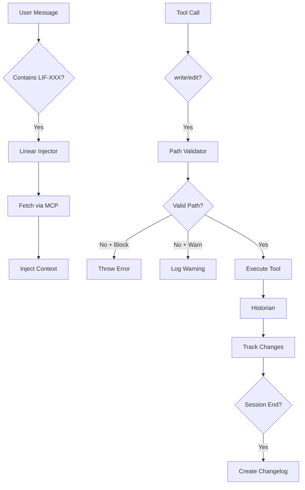

# Governance System

## Overview
The OhMyOpenCode (OMO) Governance System is a critical architectural component designed to maintain project integrity, enforce organizational standards, and provide an automated audit trail. It acts as a set of "guardrails" for AI agents, ensuring that their actions are traceable, contextually aware, and compliant with project-defined path constraints.

The system is primarily implemented through **Hooks** (lifecycle interceptors) and **Tools** (specialized capabilities).

## Configuration Schema
The governance system is configured via the `governance` block in `oh-my-opencode.json`.

```typescript
governance: {
  /** Path validation settings */
  path_validation: {
    /** Whether path validation is enabled (default: true) */
    enabled: boolean;
    /** Validation mode: 'warn' (log only), 'block' (prevent operation), 'disabled' (skip) (default: 'warn') */
    mode: "warn" | "block" | "disabled";
    /** List of allowed path prefixes relative to project root */
    allowed_paths: string[];
  },
  /** Historian (audit trail) settings */
  historian: {
    /** Whether historian tracking is enabled (default: true) */
    enabled: boolean;
    /** Whether to auto-create changelog entries on session end (default: true) */
    auto_create: boolean;
    /** Path to changelog directory (default: "changelog/") */
    changelog_path: string;
    /** Minimum number of file changes to trigger changelog creation (default: 1) */
    min_changes: number;
  },
  /** Linear integration settings */
  linear: {
    /** Whether Linear context injection is enabled (default: true) */
    enabled: boolean;
    /** Team prefix pattern for issue detection (e.g., "LIF") (default: "LIF") */
    team_prefix: string;
    /** Whether to cache issue data per session (default: true) */
    cache_issues: boolean;
  }
}
```

### TypeScript Interfaces

```typescript
export interface PathValidatorConfig {
  enabled: boolean;
  mode: "warn" | "block" | "disabled";
  allowed_paths: string[];
}

export interface HistorianConfig {
  enabled: boolean;
  auto_create: boolean;
  changelog_path: string;
  min_changes: number;
}

export interface LinearInjectorConfig {
  enabled: boolean;
  team_prefix: string;
  cache_issues: boolean;
}
```

## Path Validator Hook
**Location**: `src/hooks/governance-path-validator/`

The Path Validator prevents agents from creating or modifying files in unauthorized locations. It intercepts `write` and `edit` tool calls before execution.

### Purpose
To validate `write` and `edit` tool operations against a whitelist of allowed paths, preventing folder fragmentation and ensuring compliance with project organization rules.

### Implementation Details
- **Hook Point**: `tool.execute.before` (intercepts `write` and `edit`).
- **Validation Logic**:
  - Normalizes paths to be relative to the project root.
  - Checks if the path starts with any entry in `allowed_paths`.
- **Enforcement Modes**:
  - `warn`: Logs a warning to the console and adds metadata to the tool output, but allows the operation to proceed.
  - `block`: Throws an error, effectively canceling the tool execution.
  - `disabled`: Skips validation entirely.

### Default Allowed Paths
By default, the following paths are permitted:
- `context/specs/`
- `context/memory/`
- `.cursor/specs/`
- `.cursor/memory/`
- `.opencode/`
- `src/`
- `tests/`
- `docs/`
- `lib/`
- `packages/`

### Suggestion Logic
If a path is invalid, the validator attempts to suggest a correct location:
- **Root level writes**: Suggests `src/`, `docs/`, or `context/specs/`.
- **Misplaced Specs**: If a filename contains "spec", "plan", or "task" but is outside a spec directory, it suggests `context/specs/` or `.cursor/specs/`.

## Historian Hook
**Location**: `src/hooks/governance-historian/`

The Historian tracks all file creations and modifications within a session to generate an automated audit trail (changelog).

### Purpose
To track file creations and modifications during a session and automatically generate structured changelog entries.

### Session State Tracking
It maintains a `SessionState` for each active conversation:
- `modifiedFiles`: A Set of paths modified via `edit` or `write` (if file existed).
- `createdFiles`: A Set of paths created via `write` (if file did not exist).
- `agent`: The name of the agent performing the work.
- `startTime`: When the session began.

### Scope Inference
The system automatically infers the "scope" of work based on the files changed:
- `context/specs/{feature}/...` → scope: `{feature}`
- `src/{module}/...` → scope: `{module}`
- `docs/{page}/...` → scope: `docs-{page}`
- `tests/...` → scope: `testing`
- Default: `general`

### Changelog Generation
When a session ends (`session.deleted` event), the Historian generates a Markdown changelog if the number of changes meets the `min_changes` threshold.

**Filename Format**: `YYYY-MM-DD__{agent-slug}__{scope-slug}.md`

### Changelog Example
```markdown
# Changelog: 2025-12-17

**Agent**: OmO
**Scope**: governance-system
**Session**: sess_12345

## Summary

Session work by OmO on governance-system. 2 file(s) changed.

## Files Changed

- `+` docs/architecture/07-governance-system.md
- `~` src/config/schema.ts
```

## Linear Injector Hook
**Location**: `src/hooks/governance-linear-injector/`

The Linear Injector automatically enhances agent context by detecting Linear issue references (e.g., `LIF-123`) in the conversation.

### Purpose
To automatically detect Linear issue references in chat messages and inject detailed issue context (title, status, description, branch) into the agent's prompt.

### Workflow
1. **Detection**: Scans incoming chat messages for patterns matching `{TEAM_PREFIX}-\d+`.
2. **Fetching**: Uses the Linear API (via built-in linear tools) to fetch detailed issue metadata (title, status, description, branch name, labels).
3. **Injection**: Injects a formatted `<linear_context>` block into the agent's prompt before they respond.
4. **Caching**: Stores issue data in a session-local cache to prevent redundant API calls within the same session.

### Injected Context Format
```xml
<linear_context>
## Linear Issue Context

### LIF-123: Implement Path Validation
- **Status**: In Progress
- **URL**: https://linear.app/issue/LIF-123
- **Branch**: `feature/lif-123-implement-path-validation`
- **Labels**: backend, governance
- **Description**: Add a hook to validate file paths against allowed prefixes...
</linear_context>
```

## Governance Tools

### Linear Tools
- `linear_branch`: Retrieves the git branch name associated with a Linear issue. If no branch is set in Linear, it generates a standardized fallback: `feature/{issue-id}-{slugified-title}`.
- `linear_update_status`: Updates a Linear issue's status (`todo`, `in_progress`, `in_review`, `done`, `canceled`) and optionally adds a progress comment.
- `linear_create_issue`: Creates a new Linear issue with specified title, description, and labels.

### Project Context Tool
- `read_context`: Reads the `project-context.yaml` file. This allows agents to understand the project's tech stack, architecture, and conventions without manually exploring the entire codebase.

### Spec Tool
- `create_spec_folder`: Automates the creation of a standardized feature specification directory.
  - **Structure**: Creates `spec.md`, `plan.md`, `tasks.md`, and `status.md`.
  - **Naming**: `{ISSUE-ID}-{type}-{name-slug}` (e.g., `LIF-123-feat-auth`).

## Integration Flow



## Integration Points
- **Tool Lifecycle**: Governance hooks tap into `tool.execute.before` and `tool.execute.after` to enforce rules and track results.
- **Chat Lifecycle**: The Linear Injector uses `chat.message` to provide proactive context.
- **Event System**: The system relies on `session.created`, `session.updated`, and `session.deleted` events to manage stateful tracking (Historian and Linear Cache).
- **Linear API**: Linear integration depends on the `LINEAR_API_KEY` environment variable and uses built-in linear tools for data retrieval and updates.

## Integration with LIF-57 Enhancements
The Governance System is a core component of the LIF-57 enhancements, which focus on:
- **Spec-Driven Development**: Using `create_spec_folder` and `read_context` to ensure all features start with a solid plan.
- **Path Discipline**: Enforcing the use of `context/specs/` for planning artifacts via the Path Validator.
- **Automated Audit Trails**: Leveraging the Historian to ensure every step of the implementation is documented without manual effort.
- **Linear Synchronization**: Ensuring that the state of work in the IDE is always reflected in and informed by Linear issues.
