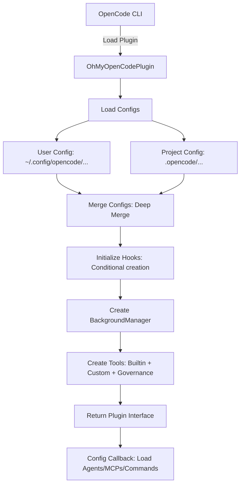
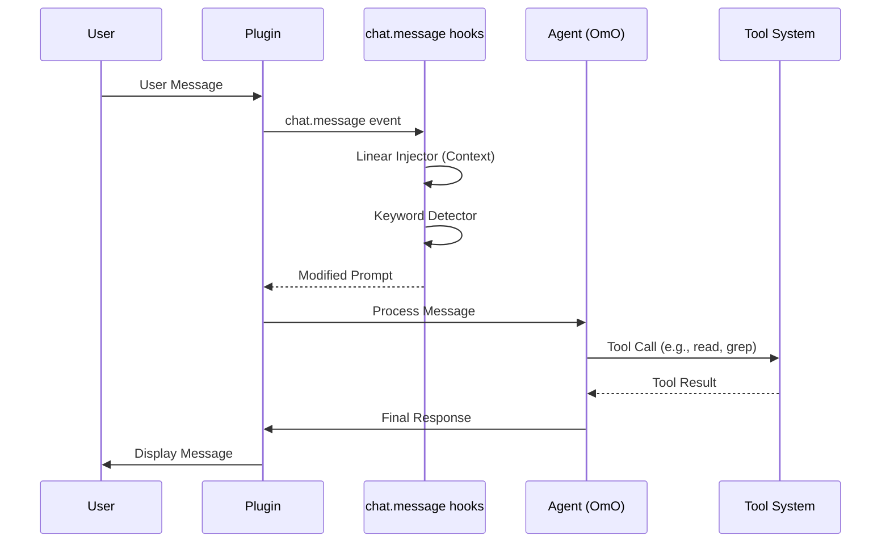
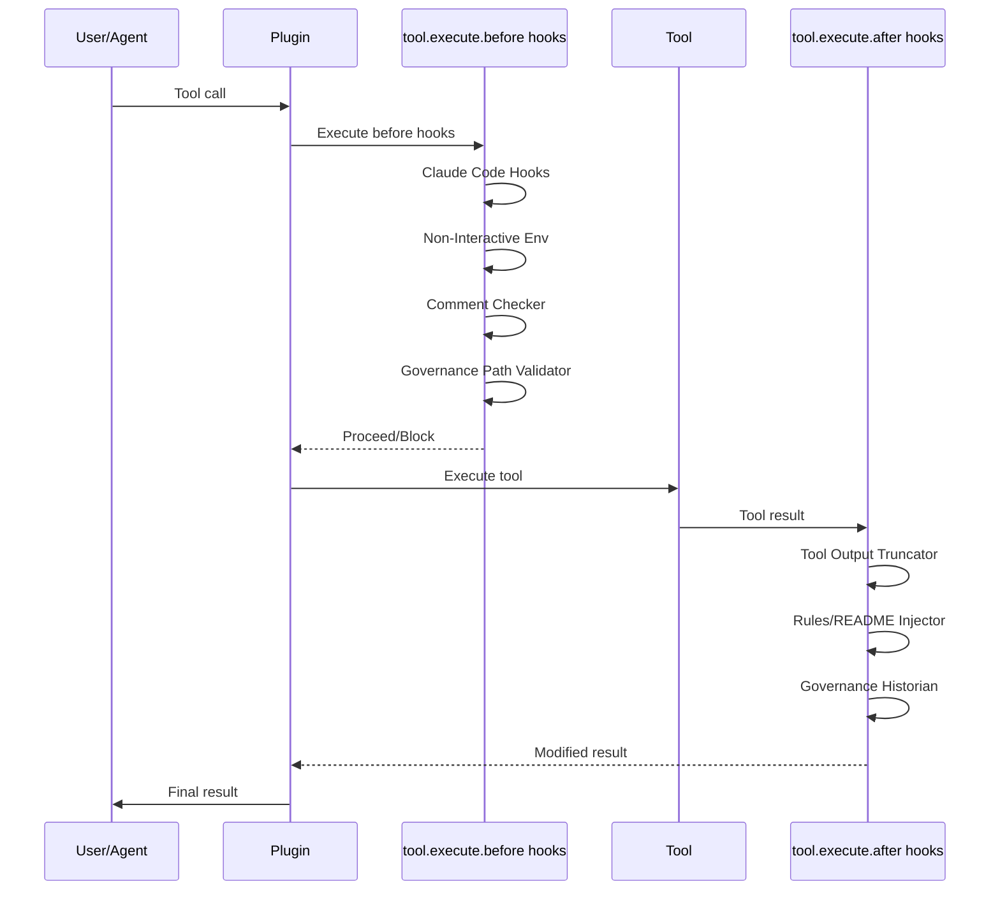
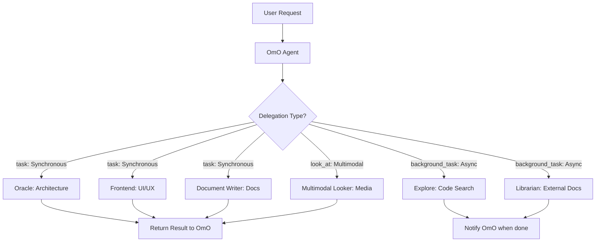
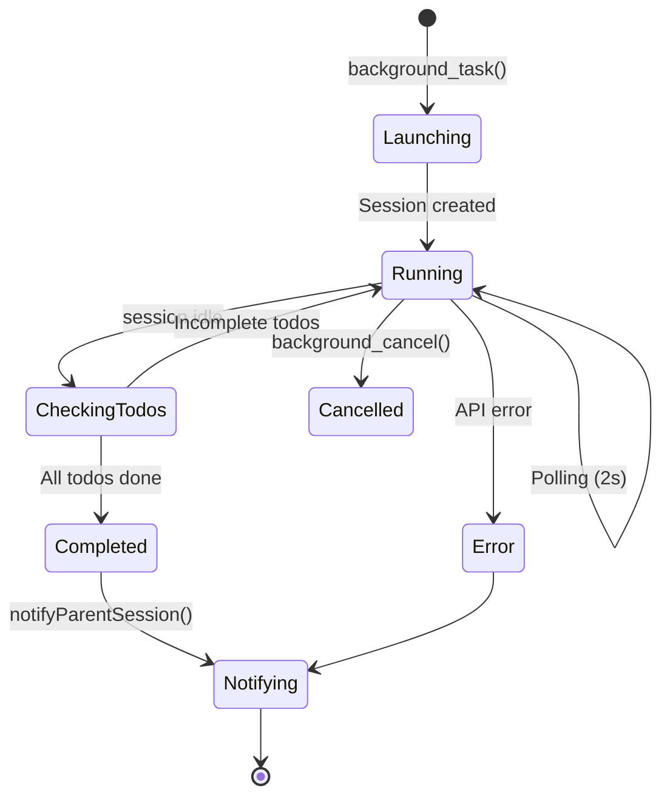
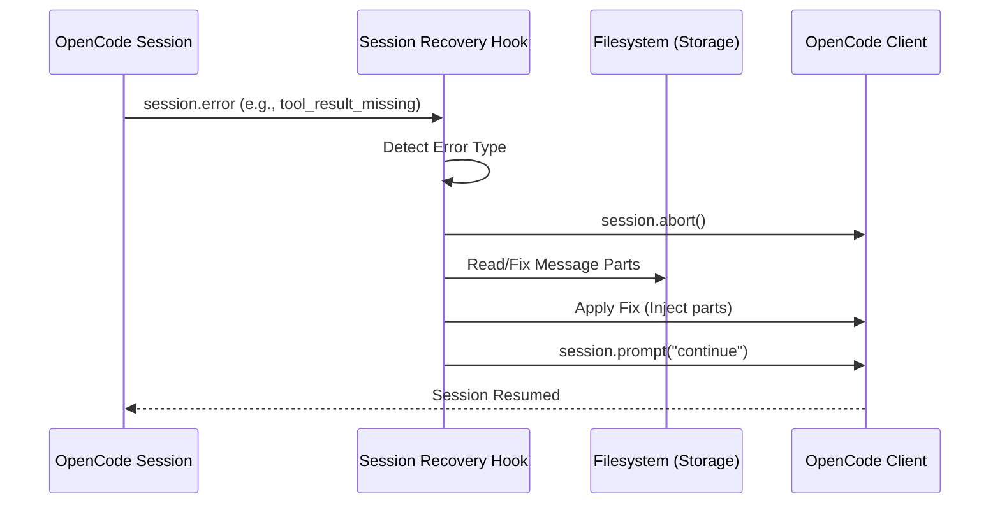
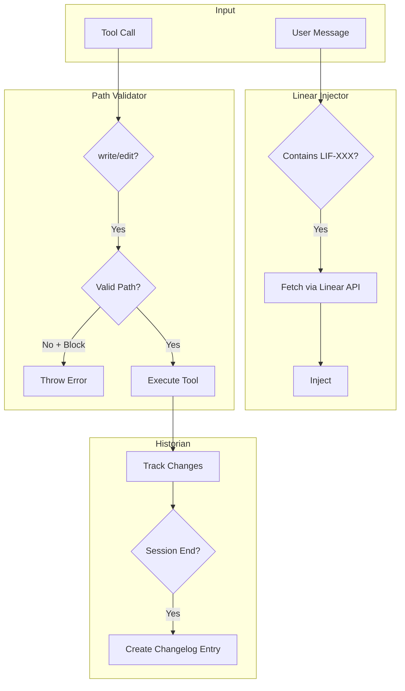
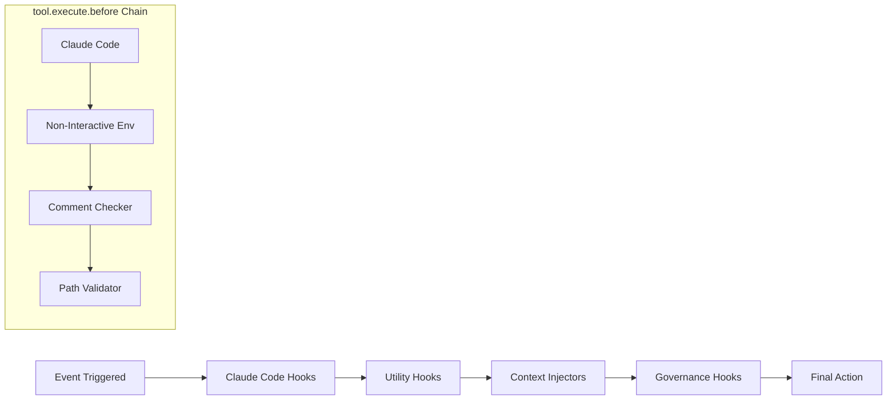
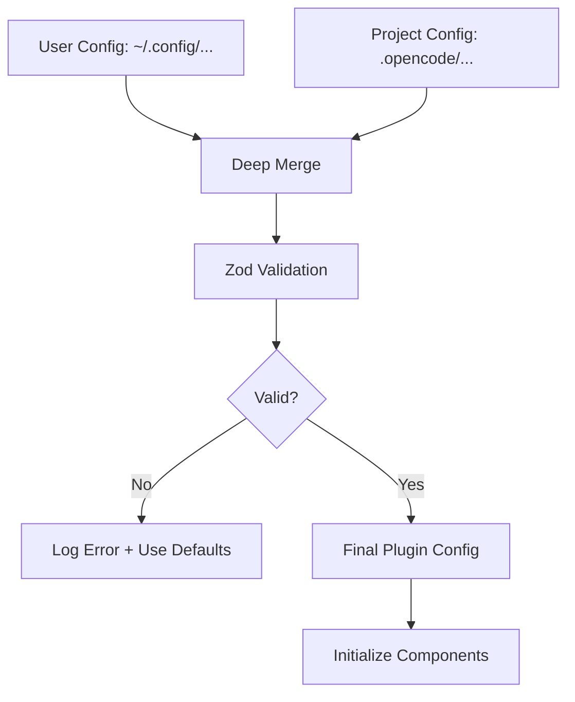
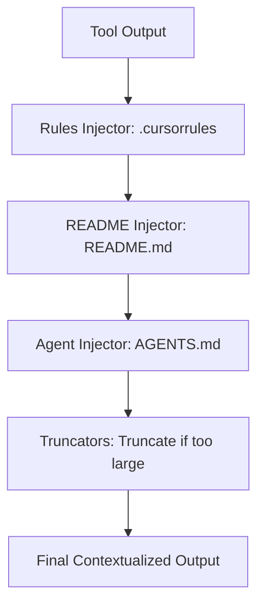

# Data Flows

This document provides a comprehensive visual guide to the data flows and component interactions within the OhMyOpenCode (OMO) plugin. These diagrams establish the architectural baseline for the system.

## 1. Plugin Initialization Flow

The initialization flow occurs when the OpenCode CLI loads the plugin. It involves loading configurations, instantiating hooks and managers, and registering tools.

## 2. Request Processing Flow

This diagram shows how a user request flows through the system, including hook interception and agent processing.

## 3. Tool Execution Flow

Tool execution is wrapped in `before` and `after` hooks to provide governance, safety, and utility functions.

## 4. Agent Orchestration Flow

OmO acts as the primary orchestrator, delegating specialized tasks to subagents using different mechanisms.

## 5. Background Task Flow

The `BackgroundManager` manages the lifecycle of asynchronous tasks, ensuring they complete their todos before notifying the parent.

## 6. Session Recovery Flow

The recovery system detects structural errors in AI responses and applies automated fixes to maintain session continuity.

## 7. Governance Data Flow

The governance system ensures all actions are compliant and traceable.

## 8. Hook Chain Flow

Hooks are executed in a specific sequence to ensure correct interaction between different features.

## 9. Configuration Loading Flow

Configurations are merged from multiple levels to allow for global defaults and project-specific overrides.

## 10. Context Injection Flow

Context is dynamically injected into tool outputs to provide the agent with relevant project knowledge.

