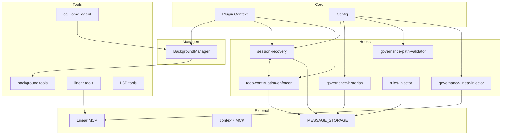

# Inter-Component Interactions and Dependencies

This document maps the relationships between various components of the OhMyOpenCode (OMO) plugin. Understanding these dependencies is critical for maintaining system stability and planning future enhancements like the LIF-57 governance modifications.

## 1. Component Dependency Matrix

The following table outlines the primary dependencies between core components:

| Component | Depends On | Used By |
|-----------|------------|---------|
| **BackgroundManager** | `ctx.client`, `MESSAGE_STORAGE` | `background_task`, `background_output`, `background_cancel`, `OmO` |
| **todo-continuation-enforcer** | `session API`, `MESSAGE_STORAGE` | `session-recovery` (callbacks) |
| **session-recovery** | `ctx.client`, `MESSAGE_STORAGE` | `todo-continuation-enforcer` (state sync) |
| **governance-historian** | `ctx.directory`, `fs`, `MESSAGE_STORAGE` | Triggered by `tool.execute.after` |
| **governance-path-validator** | `ctx.directory` | Triggered by `tool.execute.before` |
| **governance-linear-injector** | `Linear MCP`, `injectHookMessage` | Triggered by `chat.message` and `event` |
| **rules-injector** | `MESSAGE_STORAGE`, `ctx.directory` | Triggered by `tool.execute.after` |
| **directory-agents-injector** | `MESSAGE_STORAGE`, `ctx.directory` | Triggered by `tool.execute.after` |

## 2. Cross-Hook Dependencies

Some hooks are tightly coupled to ensure consistent behavior across the plugin lifecycle:

- **session-recovery ↔ todo-continuation-enforcer**: 
  - `session-recovery` provides callbacks (`setOnAbortCallback`, `setOnRecoveryCompleteCallback`) to `todo-continuation-enforcer`.
  - This prevents the continuation enforcer from injecting "continue" prompts while a session is actively being recovered from an error.
- **rules-injector → storage**: Uses `MESSAGE_STORAGE` (via `hook-message-injector` utilities) to locate the nearest `.cursorrules` or `.opencode/instructions` to inject into the context.
- **directory-agents-injector → storage**: Uses `MESSAGE_STORAGE` to track which agents have been injected into the current session to avoid duplicate prompts.

## 3. Tool-Agent Dependencies

Agents are configured with specific toolsets, often restricting powerful tools for specialized agents:

- **OmO (Orchestrator)**: Has access to all tools, including `call_omo_agent`, `look_at`, and all governance tools (`linear_*`, `read_context`).
- **oracle**: Typically restricted to read-only tools via configuration, though it has access to the full suite by default.
- **explore**: Restricted from using `call_omo_agent` to prevent recursive agent calls during exploration.
- **librarian**: Restricted from using `call_omo_agent`.
- **multimodal-looker**: Highly restricted; cannot use `task`, `call_omo_agent`, or `look_at`.

## 4. MCP Dependencies

Components that rely on External Model Context Protocol (MCP) servers:

- **librarian agent**: Depends on `context7` (docs), `websearch_exa` (search), and `grep_app` (code search).
- **governance-linear-injector**: Depends on the `Linear MCP` to fetch issue context and inject it into the chat.
- **Linear tools**: `linear_branch`, `linear_update_status`, and `linear_create_issue` all require the `Linear MCP` to be configured and enabled.

## 5. Shared State Dependencies

OMO components share state through several mechanisms:

- **MESSAGE_STORAGE**: A filesystem-based cache (`.opencode/messages/`) used by `hook-message-injector`, `todo-continuation-enforcer`, `rules-injector`, and `governance-historian` to maintain session context.
- **Session State**: `claude-code-session-state` maintains global variables for `mainSessionID` and `currentSessionID`, used by the terminal title updater and various hooks to identify the primary interaction thread.
- **BackgroundManager tasks Map**: An in-memory `Map` that tracks running background tasks, their progress, and parent session associations.

## 6. Event Flow Dependencies

Components react to specific OpenCode lifecycle events:

- **session.created**: 
  - `session-notification`: Displays a toast for new sessions.
  - `terminal`: Updates the terminal title with the new session ID.
- **session.idle**: 
  - `todo-continuation-enforcer`: Checks for incomplete todos to trigger "continue".
  - `background-manager`: Detects when a background session has finished its task.
- **session.error**: 
  - `session-recovery`: Initiates recovery logic for recoverable errors (e.g., rate limits, timeouts).
  - `todo-continuation-enforcer`: Suppresses prompts during error states.
- **session.deleted**: 
  - `background-manager`: Cleans up tasks associated with the deleted session.
  - All hooks: Perform internal cleanup if necessary.

## 7. Configuration Dependencies

The `OhMyOpenCodeConfig` (merged from user and project levels) drives component initialization:

- `disabled_hooks`: Prevents specific hooks from being instantiated in `src/index.ts`.
- `disabled_agents`: Filtered during `createBuiltinAgents`.
- `disabled_mcps`: Filtered during `createBuiltinMcps`.
- `governance.*`: Configures the behavior of `path-validator`, `historian`, and `linear-injector`.
- `claude_code.*`: Determines whether to load external Claude Code agents, commands, skills, and MCPs.

## 8. Initialization Order Dependencies

The plugin must be initialized in a specific sequence to ensure all dependencies are met:

1. **Load Configuration**: Merge user-level and project-level `oh-my-opencode.json`.
2. **Hook Instantiation**: Create hook instances (some require the merged config).
3. **Hook Wiring**: Connect interdependent hooks (e.g., `session-recovery` to `todo-continuation-enforcer`).
4. **Manager Creation**: Initialize the `BackgroundManager` with the plugin context.
5. **Tool Creation**: Create tools, passing the `BackgroundManager` to background-related tools.
6. **Auth Initialization**: (Optional) Initialize Google Antigravity OAuth if enabled.
7. **Return Plugin Interface**: Export the final `tool`, `chat.message`, `config`, `event`, and `tool.execute` handlers.

## 9. Runtime Dependencies

- **Tool Execution**: Requires hooks to be initialized as they wrap the `before` and `after` execution phases.
- **Background Tasks**: Depend on the `BackgroundManager` polling loop and event handlers to track completion.
- **Governance**: `governance-historian` depends on the output of tools to determine if a changelog entry is required.

## 10. Circular Dependency Prevention

OMO employs several patterns to avoid circular dependencies:

- **Callback Injection**: Instead of hooks importing each other, they accept optional callbacks during initialization (e.g., in `src/index.ts`).
- **Lazy Initialization**: Commands, agents, and MCPs are loaded dynamically or during the `config` lifecycle hook rather than at plugin startup.
- **Event-Driven Communication**: Components like the `BackgroundManager` use the central event bus to communicate state changes rather than direct method calls.

## Dependency Graph

