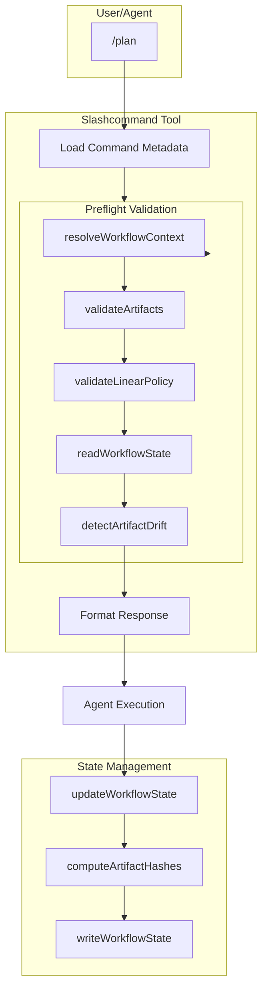

# Workflow System

## Overview

The OhMyOpenCode Workflow System provides a structured, validated approach to feature development through six workflow commands: `specify`, `plan`, `tasks`, `implement`, `review`, and `test`. The system enforces prerequisites, tracks progress across sessions, and maintains continuity through state persistence.

**Key Features**:
- **Preflight Validation**: Block commands until prerequisites are met
- **State Persistence**: Resume workflows after session restarts
- **Drift Detection**: Identify manual changes to workflow artifacts
- **Linear Integration**: Sync workflow state with Linear issue status
- **Categorized Commands**: Organized help with clear progression

## Architecture

### System Diagram



## Core Components

### 1. Workflow Context

**Source**: `src/shared/workflow-context.ts`

The Workflow Context resolves the execution environment for workflow commands.

#### Context Resolution

**Resolution Priority**:
1. **Explicit Arguments**: `--spec-dir`, `--linear-issue-id` from CLI
2. **Branch Parsing**: Extract issue ID from branch name (e.g., `hello/lif-123-feature`)
3. **Spec Folder Detection**: Search for matching spec folder in `.cursor/specs/` or `context/specs/`
4. **Defaults**: Fallback values if nothing found

**Context Schema**:
```typescript
interface WorkflowContext {
  specPath: string | null           // Path to spec folder
  linearIssueId: string | null      // Linear issue ID (e.g., "LIF-123")
  branchName: string | null          // Git branch name
  policy: LinearPolicy               // "off" | "optional" | "required"
  runId: string                      // Unique execution ID
  repoRoot: string                   // Absolute path to repo root
  resolvedFrom: ContextSource        // How context was resolved
}
```

#### Key Functions

| Function | Purpose |
|----------|---------|
| `resolveWorkflowContext(options)` | Main entry point - resolves full context |
| `parseIssueIdFromBranch(branch)` | Extract `LIF-123` from branch name |
| `findSpecFolderByIssueId(id, root)` | Locate spec folder matching issue ID |
| `extractIssueIdFromSpecPath(path)` | Parse issue ID from folder name |
| `getDefaultLinearPolicy()` | Read policy from env or config |

### 2. Preflight Validation

**Source**: `src/shared/command-preflight.ts`

Preflight validates prerequisites before command execution.

#### Validation Checks

**1. Artifact Validation**
- Checks if required files exist in spec folder
- Example: `/plan` requires `spec.md`
- Returns `MISSING_SPEC_MD` error if not found

**2. Linear Policy Validation**
- Verifies Linear issue ID based on policy:
  - `off`: No validation
  - `optional`: Warn if missing
  - `required`: Block if missing
- Configurable via `OPENCODE_LINEAR_POLICY` env var

**3. Workflow State Check**
- Loads previous state from `workflow-state.json`
- Detects artifact drift (file modifications)
- Generates resume message for continuity

#### Preflight Result

```typescript
interface PreflightResult {
  status: "ok" | "warning" | "blocked"
  context: WorkflowContext
  issues: PreflightIssue[]         // Validation errors/warnings
  fixes: PreflightFix[]            // Suggested remediation
  workflowState: WorkflowState | null
  resumeMessage: string | null
}
```

**Status Types**:
- `ok`: All validations passed
- `warning`: Non-blocking issues (drift, optional policy violation)
- `blocked`: Missing prerequisites, command cannot execute

#### Artifact Requirements

| Step | Required Artifacts |
|------|-------------------|
| `specify` | None |
| `plan` | `spec.md` |
| `tasks` | `spec.md`, `plan.md` |
| `implement` | `spec.md`, `plan.md`, `tasks.md` |
| `review` | `spec.md` |
| `test` | `spec.md` |

#### Error Handling

When blocked, preflight provides:
- **Error Message**: Clear description of what's missing
- **Fix Suggestion**: Command to resolve issue (e.g., "Run `/specify`")
- **Context**: Current spec path, Linear issue, resolved values

**Example Blocked Response**:
```
❌ Preflight blocked

Issues:
  ❌ Required artifact not found: spec.md

Fixes:
  → Run /specify to create spec.md
    Run: /specify
```

### 3. State Persistence

**Source**: `src/tools/spec/tools.ts` (`update_workflow_state` tool)

State persistence tracks workflow progress for session continuity.

#### Workflow State Schema

**File**: `{spec-folder}/workflow-state.json`

```typescript
interface WorkflowState {
  currentStep: WorkflowStep        // "plan" | "tasks" | etc.
  completedSteps: WorkflowStep[]   // ["specify", "plan"]
  artifactHashes: Record<string, string>  // File SHA-256 hashes
  linearIssueId: string | null
  linearStatus: string | null       // Linear issue status
  createdAt: string                 // ISO timestamp
  updatedAt: string                 // ISO timestamp
  lastCommand: string               // "/plan"
}
```

**Example**:
```json
{
  "currentStep": "plan",
  "completedSteps": ["specify"],
  "artifactHashes": {
    "spec.md": "a1b2c3d4e5f6g7h8",
    "plan.md": "i9j0k1l2m3n4o5p6"
  },
  "linearIssueId": "LIF-123",
  "linearStatus": "in_progress",
  "createdAt": "2025-12-18T10:00:00Z",
  "updatedAt": "2025-12-18T11:30:00Z",
  "lastCommand": "/plan"
}
```

#### Drift Detection

**Mechanism**: SHA-256 hash comparison

1. **Initial Hash**: Computed when artifact created
2. **Subsequent Hash**: Recomputed on next workflow step
3. **Comparison**: If hashes differ, drift detected
4. **Warning**: Preflight shows drift warning

**Purpose**: Catch manual edits that may invalidate workflow assumptions

**Drift Warning Example**:
```
⚠️ Preflight passed with warnings

Issues:
  ⚠️ spec.md changed since last workflow step
```

#### State Functions

| Function | Purpose |
|----------|---------|
| `readWorkflowState(specPath)` | Load state from JSON file |
| `writeWorkflowState(specPath, state)` | Save state to JSON file |
| `updateWorkflowState(specPath, step, linearStatus?)` | Update state and persist |
| `computeArtifactHashes(specPath)` | Generate SHA-256 hashes for drift detection |
| `detectArtifactDrift(specPath, state)` | Compare current vs. saved hashes |
| `formatResumeMessage(state)` | Generate human-readable resume message |

### 4. Update Workflow State Tool

**Tool Name**: `update_workflow_state`

Agents call this tool after completing a workflow step to persist progress.

**Important**: Each workflow command (`/specify`, `/plan`, `/tasks`, `/implement`, `/review`, `/test`) includes explicit instructions for agents to call this tool at the end of execution. This ensures state is always persisted when commands complete successfully.

#### Tool Arguments

```typescript
{
  specPath: string,           // Required: path to spec folder
  step: WorkflowStep,         // Required: completed step
  linearStatus?: string       // Optional: Linear status to set
}
```

#### Usage Example

```typescript
// After completing /plan
update_workflow_state({
  specPath: ".cursor/specs/LIF-123-feat-auth",
  step: "plan",
  linearStatus: "in_progress"
})
```

#### Tool Response

```typescript
interface UpdateWorkflowStateResult {
  success: boolean
  specPath: string
  step: string
  previousStep?: string
  completedSteps: string[]
  message: string
  error?: string
}
```

## Workflow Commands

### Command Metadata

Each workflow command has frontmatter metadata:

```yaml
step: plan              # Workflow step name
requires:               # Prerequisite artifacts
  - spec.md
produces:               # Output artifacts
  - plan.md
next: tasks             # Next recommended step
linear_status: in_progress  # Linear status after completion
category: workflow      # Command category
primary: true           # Show first in help
```

### Workflow Progression

```
/specify → /plan → /tasks → /implement → /review → /test
```

#### Step Details

| Step | Description | Requires | Produces | Linear Status |
|------|-------------|----------|----------|---------------|
| **specify** | Create feature specification | - | `spec.md` | `todo` |
| **plan** | Create implementation plan | `spec.md` | `plan.md` | `in_progress` |
| **tasks** | Break down into tasks | `spec.md`, `plan.md` | `tasks.md` | `in_progress` |
| **implement** | Implement the feature | All artifacts | `implementation/` | `in_progress` |
| **review** | Code review | `spec.md` | `reviews/` | `in_review` |
| **test** | Write and run tests | `spec.md` | `tests/` | `in_review` |

## Integration Points

### Slashcommand Tool

**Source**: `src/tools/slashcommand/tools.ts`

The slashcommand tool integrates preflight automatically:

1. **Load Command**: Read command file and parse frontmatter
2. **Check for Workflow**: If `step` field exists, it's a workflow command
3. **Run Preflight**: Call `commandPreflight()` with requirements
4. **Handle Result**:
   - `blocked`: Show errors and stop
   - `ok`/`warning`: Inject preflight context into command prompt
5. **Format Command**: Return command instructions with full context

**Automatic Preflight Trigger**:
```typescript
if (cmd.metadata.step) {
  preflight = commandPreflight({
    command: cmd.metadata.step,
    requiredArtifacts: cmd.metadata.requires,
    createSpecFolder: cmd.metadata.step === "specify",
  })
}
```

### Linear Integration

Workflow state syncs with Linear issue status:

- `/specify` → `todo`
- `/plan`, `/tasks`, `/implement` → `in_progress`
- `/review`, `/test` → `in_review`

**Implementation**: `linear_status` field in command frontmatter

**Update Mechanism**: Agent calls `update_workflow_state` with `linearStatus` parameter

## Configuration

### Linear Policy

**Environment Variable**: `OPENCODE_LINEAR_POLICY`

**Values**:
- `off`: No Linear integration
- `optional` (default): Warn if missing, don't block
- `required`: Block commands without Linear issue

**Usage**:
```bash
export OPENCODE_LINEAR_POLICY=required
```

### Spec Folder Paths

**Supported Locations**:
- `.cursor/specs/` (primary)
- `context/specs/` (alternative)

**Folder Naming**:
- With Linear: `{ISSUE-ID}-{type}-{name-slug}` (e.g., `LIF-123-feat-user-auth`)
- Without Linear: `{NNN}-{type}-{name-slug}` (e.g., `001-feat-user-auth`)

## Error Scenarios

### Missing Prerequisites

**Scenario**: User runs `/plan` before `/specify`

**Preflight Result**:
```
❌ Preflight blocked

Issues:
  ❌ No spec folder found
  ❌ Required artifact not found: spec.md

Fixes:
  → Create spec folder with /specify or manually
    Run: /specify
```

**Resolution**: User runs `/specify` first

### Artifact Drift

**Scenario**: User manually edits `spec.md` between workflow steps

**Preflight Result**:
```
⚠️ Preflight passed with warnings

Issues:
  ⚠️ spec.md changed since last workflow step

📋 Resuming from: Planning (1 steps complete, last updated 12/18/2025)
```

**Impact**: Non-blocking warning; workflow continues

### Session Continuity

**Scenario**: User restarts session mid-workflow

**Preflight Behavior**:
1. Load `workflow-state.json`
2. Generate resume message: `📋 Resuming from: Planning (1 steps complete, last updated 12/18/2025)`
3. Show completed steps and current position
4. Proceed with command

## Performance Considerations

### Caching

- **Workflow Context**: Cached per command invocation
- **Linear Issues**: Cached per session (if enabled)
- **Spec Folder Lookup**: Scanned once on branch change

### Latency

- **Preflight Overhead**: ~50-100ms per command
- **State Read/Write**: ~10-20ms (local file I/O)
- **Hash Computation**: ~5-10ms per artifact

**Total**: Adds ~100ms to command execution time

## Future Enhancements

1. **Workflow Branching**: Support parallel workflows (implement + test simultaneously)
2. **State Rollback**: Undo workflow steps
3. **Workflow Templates**: Predefined workflows per project type
4. **Visual Progress**: UI showing completion status
5. **Workflow Hooks**: Custom actions on step transitions
6. **Multi-Spec Coordination**: Manage dependencies between features

## References

- [ADR-004: Workflow Command System](/architecture/decisions/ADR-004-workflow-command-system)
- Source: `src/shared/workflow-context.ts`
- Source: `src/shared/command-preflight.ts`
- Source: `src/tools/spec/tools.ts`
- Source: `src/tools/slashcommand/tools.ts`
- Implementation: LIF-65, LIF-67
