# Agent Hierarchy

The OhMyOpenCode (OMO) Agent System follows a multi-layered orchestration model. At the top level, **OmO** acts as the primary orchestrator and team lead, delegating complex tasks to specialized managers and specialists.

## Hierarchy Tree

```mermaid
graph TD
    OmO[OmO<br/>Team Lead<br/>Claude Opus 4.5]
    
    subgraph Workflow Specialists
        PS[product-strategist<br/>Gemini Pro]
        SP[strategic-planner<br/>GPT-5.2]
        TP[task-planner<br/>Claude Sonnet]
    end

    subgraph Implementation Specialists
        IS[implementation-specialist<br/>Manager<br/>Claude Sonnet]
        
        TS[backend-typescript]
        BR[backend-rust]
        BP[backend-python]
        FR[frontend-react]
        UI[frontend-ui-ux-engineer]
        MX[mobile-xcode]
        MR[mobile-react-native]
        DW[document-writer]
        AM[ai-ml-expert]
        AS[agent-specialist]
    end

    subgraph Cross-Cutting Specialists
        SEC[security-specialist]
        TEST[test-specialist]
        OPT[optimization-specialist]
    end

    subgraph Utilities
        OR[oracle<br/>Advisor]
        LB[librarian]
        EX[explore]
        ML[multimodal-looker]
    end

    OmO --> PS
    OmO --> SP
    OmO --> TP
    OmO --> IS
    OmO --> OR
    OmO --> LB
    OmO --> EX
    OmO --> ML
    
    IS --> TS
    IS --> BR
    IS --> BP
    IS --> FR
    IS --> UI
    IS --> MX
    IS --> MR
    IS --> DW
    IS --> AM
    IS --> AS
    IS --> SEC
    IS --> TEST
    IS --> OPT
```



## Role Classification

| Role | Can Delegate | Modifies Files | Purpose | Examples |
|------|--------------|----------------|---------|----------|
| **team-lead** | Yes | Yes | Primary orchestrator, user interaction | OmO |
| **manager** | Yes | Yes | Orchestrates sub-tasks and specialists | implementation-specialist |
| **specialist** | No | Yes | Expert execution of specific domain tasks | backend-typescript, test-specialist |
| **advisor** | No | No | High-level analysis and review | oracle |
| **utility** | No | No | Targeted information retrieval/analysis | explore, librarian, multimodal-looker |

## Workflow Specialists (LIF-72)

Ported from markdown-based agents to built-in TypeScript agents, these specialists handle the core development lifecycle:

| Agent | Workflow Command | Model | Responsibility |
|-------|-----------------|-------|----------------|
| **product-strategist** | `/specify` | `gemini-3-pro` | Requirement analysis, spec creation |
| **strategic-planner** | `/plan` | `gpt-5.2` | Architectural design, implementation plan |
| **task-planner** | `/tasks` | `claude-sonnet-4-5` | Breaking plans into actionable tasks |

## Delegation Patterns

### 1. Direct Command Delegation
When a user invokes a workflow command (e.g., `/specify`), OmO delegates directly to the corresponding specialist using `call_omo_agent`.

### 2. Implementation Delegation
OmO delegates complex implementation work to the `implementation-specialist`, which further delegates to domain specialists (TypeScript, Rust, etc.) based on the tech stack.

### 3. Utility Backgrounding
OmO fires `explore` or `librarian` agents as `background_task` to gather context without blocking the main workflow.

### 4. Advisor Review
OmO or `implementation-specialist` can call `oracle` for a high-level review of a proposed plan or implementation.

## Agent Registration

Agents are registered in `src/agents/index.ts` and managed via the `AgentManager`. This allows for project-specific overrides in `oh-my-opencode.json`.

```typescript
// Example Agent Definition
export const productStrategist: AgentDefinition = {
  name: "product-strategist",
  model: "google/gemini-3-pro-preview",
  role: "specialist",
  description: "Requirement analysis and feature specification expert",
  // ...
};
```
