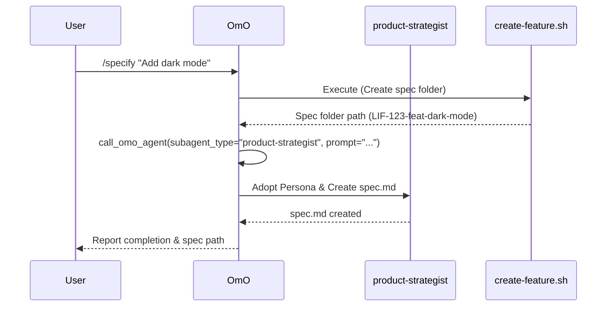
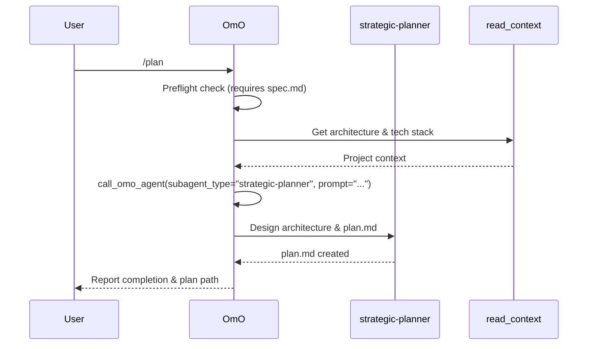
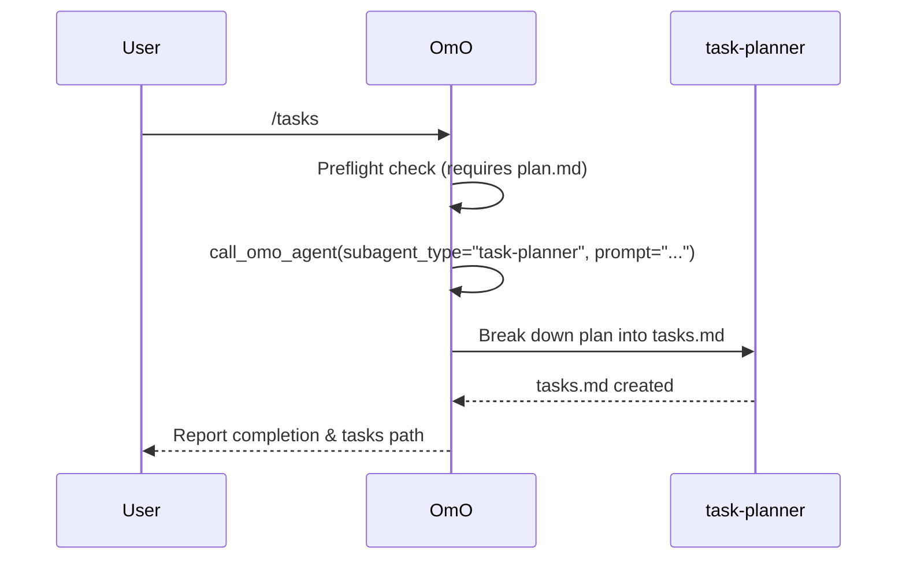
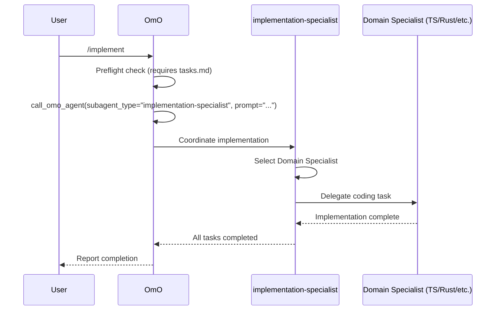

# Workflow Orchestration

OhMyOpenCode implements a structured development workflow where each phase is managed by a specialized agent. This orchestration is triggered by workflow commands and coordinated by **OmO** (the primary orchestrator) using the `call_omo_agent` tool.

## Workflow Commands

The system defines six primary workflow commands that guide a feature from specification to testing:

| Command | Specialist Agent | Phase | Output |
|---------|------------------|-------|--------|
| `/specify` | `product-strategist` | Specification | `spec.md` |
| `/plan` | `strategic-planner` | Planning | `plan.md` |
| `/tasks` | `task-planner` | Task Breakdown | `tasks.md` |
| `/implement` | `implementation-specialist` | Implementation | Source Code |
| `/review` | `oracle` | Review | Review Report |
| `/test` | `test-specialist` | Testing | Test Suite |

## Delegation Mechanism

Workflow commands are loaded as markdown instructions that guide OmO to delegate the actual work. Since LIF-72, these specialists are built-in TypeScript agents, allowing for better type safety, tool integration, and performance.

### call_omo_agent Tool
OmO uses the `call_omo_agent` tool to delegate tasks synchronously. This tool:
1. Instantiates the specialized agent with its unique system prompt and toolset.
2. Manages a sub-session for the specialist's execution.
3. Returns the specialist's final output and modified files back to OmO.

## Orchestration Sequences

### Specification Phase (`/specify`)

### Planning Phase (`/plan`)

### Task Phase (`/tasks`)

### Implementation Phase (`/implement`)

## Workflow Continuity

### State Persistence
After each phase, OmO calls `update_workflow_state` to persist:
- The completed step
- Artifact hashes (for drift detection)
- Linear issue status

### Resume Mechanism
If a session is restarted, the `commandPreflight` tool reads the persisted state and provides a resume message, allowing OmO to understand where it left off in the workflow.
