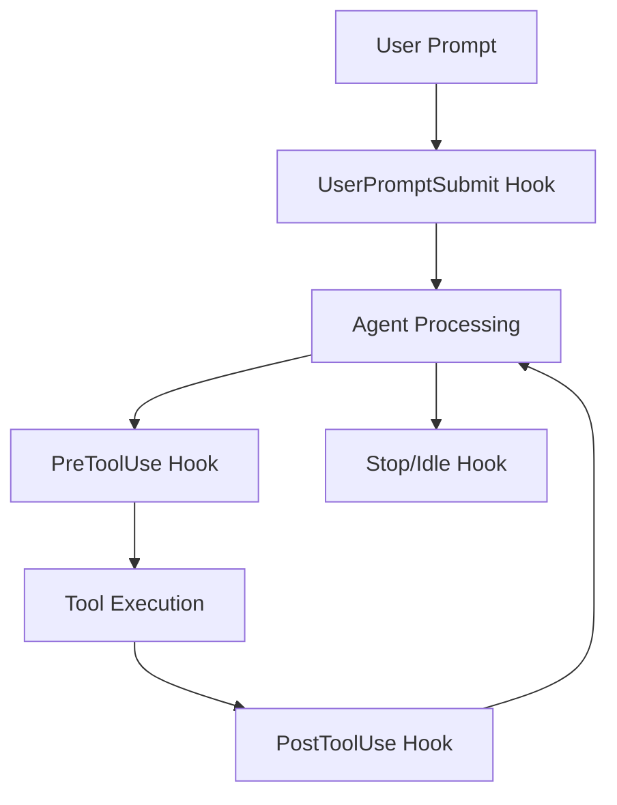
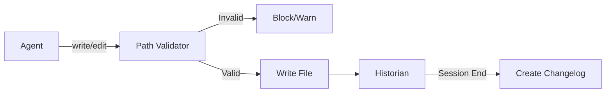

# Governance Hooks

Governance in OhMyOpenCode is implemented through a series of lifecycle hooks that automatically intercept agent actions, validate them against project standards, and maintain an audit trail.

## Hook Lifecycle

Hooks are triggered at various points in the agent's execution cycle:



## Core Governance Hooks

### 1. governance-path-validator
Ensures all file operations follow the project's directory structure and naming conventions.

- **Trigger**: `PreToolUse` (intercepts `write` and `edit`)
- **Action**: Validates the `filePath` argument against allowed paths.
- **Modes**:
  - `warn`: Logs a warning and injects a reminder into the context.
  - `block`: Prevents the tool execution if the path is unauthorized.
- **Allowed Paths**: `.cursor/specs/`, `context/`, `src/`, `tests/`, `docs/`, `.opencode/`.

### 2. governance-linear-injector
Automatically provides Linear issue context to the agent when working on specific branches.

- **Trigger**: `UserPromptSubmit` or `Session Startup`
- **Action**: Detects Linear issue IDs (e.g., `LIF-123`) from the branch name or spec folder and fetches issue details from Linear.
- **Injection**: Injects issue title, description, and status into the agent's system prompt.

### 3. governance-historian
Maintains an automatic audit trail of all changes made during a session.

- **Trigger**: `PostToolUse` (tracks changes) and `Stop` (persists changelog)
- **Action**: Records every file creation or modification.
- **Output**: Generates a markdown changelog entry in `changelog/` on session end, following the format: `YYYY-MM-DD__agent-name__issue-id.md`.

### 4. workflow-state-enforcer
Enforces the spec-driven development workflow and recommends appropriate specialists.

- **Trigger**: `UserPromptSubmit` (detects workflow commands like `/plan`)
- **Action**: Verifies prerequisites (e.g., `/plan` requires `spec.md`).
- **Delegation**: Recommends the specific specialist agent (e.g., `strategic-planner`) and provides the `call_omo_agent` tool signature.

## Governance Flow



## Hook Configuration

Hooks can be enabled, disabled, or configured via `oh-my-opencode.json`:

```json
{
  "governance": {
    "path_validation": {
      "mode": "block",
      "allowed_paths": ["src/", "docs/"]
    },
    "historian": {
      "auto_create": true
    }
  },
  "disabled_hooks": ["comment-checker"]
}
```

## Additional Hooks

- **governance-docs-delegation**: Automatically delegates documentation updates to the `document-writer` agent when doc files are modified.
- **comment-checker**: Analyzes code changes and warns against excessive or redundant comments.
- **todo-continuation-enforcer**: Ensures that if a task list was created, it is fully completed before the session ends.
