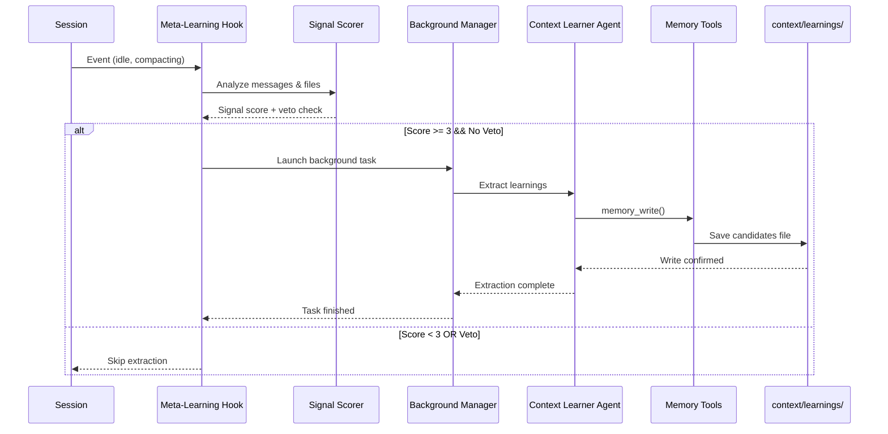

# Meta-Learning System

The Meta-Learning System enables OhMyOpenCode to learn from sessions and continuously improve orchestration, delegation patterns, and agent instructions. It monitors high-signal conversations, extracts structured improvement opportunities, and persists them for review and application.

## Overview

The system operates on a "detect → extract → persist → review" cycle. A hook monitors session activity for meaningful patterns, a specialized agent analyzes qualifying sessions, and learnings are stored as structured markdown files for human review and approval.

### Core Principle

The system focuses on **meta-level improvements**—enhancing how OmO and its agents work together—rather than project-specific knowledge. It extracts insights about tool selection, delegation patterns, command workflows, and context management.

## Architecture Components

| Component | Location | Purpose |
|-----------|----------|---------|
| **Meta-Learning Hook** | `src/hooks/meta-learning-extractor/` | Monitors sessions and triggers extraction |
| **Signal Scorer** | `src/hooks/meta-learning-extractor/signal-scorer.ts` | Evaluates session quality signals |
| **Context Learner Agent** | `src/agents/context-learner.ts` | Analyzes sessions and extracts learnings |
| **Memory Tools** | `src/tools/memory/` | Serena-compatible file persistence |
| **Supporting Features** | `src/features/context-learning/` | Secret redaction, file writing, types |
| **Commands** | `/extract-learnings`, `/review-learnings` | Manual control interface |

## Data Flow



## Signal Scoring System

The hook uses a multi-signal scoring system to identify sessions worth analyzing. Points accumulate from detected signals, and extraction triggers when the threshold is met without any veto conditions.

### Signal Categories

| Signal Type | Points | Signals |
|-------------|--------|---------|
| **Strong** | +3 | `edited_memory_files`, `created_shared_utilities`, `architectural_decisions`, `cross_file_refactoring` |
| **Medium** | +2 | `decision_language`, `pattern_identification`, `cross_file_impact` |
| **Weak** | +1 | `new_file_types`, `config_changes`, `dependency_changes` |

### Signal Detection Patterns

```typescript
// Strong: Memory file edits
const MEMORY_FILE_PATTERNS = [
  /\.cursor\/memory\//,
  /context\/memory\//,
  /AGENTS\.md$/,
  /constitution\.md$/,
]

// Strong: Shared utilities
const SHARED_UTILITY_PATTERNS = [
  /shared\//, /utils\//, /helpers\//, /lib\//, /common\//
]

// Medium: Decision language
const DECISION_KEYWORDS = [
  "decided to", "chose", "selected", "opted for",
  "tradeoff", "instead of", "better approach"
]
```

### Veto Conditions

Extraction is blocked when any veto condition is detected:

| Condition | Detection | Reason |
|-----------|-----------|--------|
| `single_file_change` | ≤1 files modified | Too narrow for generalizable learnings |
| `environment_specific` | Keywords: "my machine", "locally", "env var" | Not transferable |
| `speculation` | Keywords: "might", "probably", "not sure" (≥3) | Insufficient confidence |

## Triggers

| Trigger | Event | Purpose |
|---------|-------|---------|
| `idle` | `session.idle` (debounced 5s) | Background extraction during natural pauses |
| `pre_compaction` | `experimental.session.compacting` | Capture learnings before history is lost |
| `manual` | `/extract-learnings` command | User-initiated extraction |

## Budget & Cooldown Controls

The system implements cost controls to prevent runaway spending and redundant extractions.

| Control | Default | Description |
|---------|---------|-------------|
| **Daily Budget** | $0.10 USD | Maximum daily spend across all sessions |
| **Cooldown** | 30 minutes | Minimum time between extractions per session |
| **Per-Extraction Cost** | ~$0.05 | Estimated cost using Claude Opus 4.5 |

Budget resets automatically at midnight (local time). Cooldown is per-session and tracked independently.

## Context Learner Agent

**Model**: `anthropic/claude-opus-4-5`  
**Temperature**: 0.1  
**Mode**: subagent

The agent analyzes session context and produces structured learning candidates:

### Meta-Learning Categories

| Category | What It Improves | Example |
|----------|------------------|---------|
| `agent_instructions` | Agent prompts, roles, capabilities | "OmO should delegate frontend work earlier" |
| `commands` | Slash command behavior, workflows | "/implement should check for tasks.md first" |
| `orchestration` | Delegation patterns, agent selection | "Use explore agent for file discovery before implementation" |
| `context_handling` | Memory management, compaction timing | "Extract learnings at 60% context, not 80%" |
| `tool_usage` | Tool selection, efficiency | "Use LSP goto_definition instead of grep for symbol lookup" |

### Quality Guidelines

The agent follows strict quality rules to prevent noise:

- **Maximum 3 candidates** per session
- **Minimum confidence** 0.5
- **Evidence-based only** — no speculation
- **Specific improvements** — actionable changes, not vague suggestions

## Output Format

Learnings are saved as structured markdown files:

**Path**: `context/learnings/{session_id}_{date}.md`

```markdown
# Meta-Learning Candidates

## Metadata
- Session: abc12345
- Trigger: idle
- Timestamp: 2025-12-26T10:30:00Z
- Signal Score: 5

## Candidates

### 1. Improved Tool Selection for Refactoring
- **Category**: tool_usage
- **Claim**: Agent should prefer ast_grep_replace over multi-file Edit for renames
- **Confidence**: 0.85
- **Scope**: When renaming symbols across 3+ files
- **Evidence**: Session involved 15 manual edits that failed due to context limits
- **Suggested Improvement**: Update orchestration policy to favor AST tools for bulk changes
- **Affected Files**: src/shared/delegation-policy.ts

---

## Extraction Notes
- Total Candidates: 2
- High Confidence (>0.8): 1
- Medium Confidence (0.5-0.8): 1
```

## Memory Tools

Five Serena-compatible tools provide persistent storage:

| Tool | Purpose |
|------|---------|
| `memory_write` | Write content to a memory file |
| `memory_read` | Read content from a memory file |
| `memory_list` | List all memory files |
| `memory_edit` | Edit via regex or literal replacement |
| `memory_delete` | Delete a memory file |

### Security Features

| Protection | Implementation |
|------------|----------------|
| **Path Traversal** | `..` sequences blocked |
| **Containment** | All files within configured basePath |
| **Invalid Characters** | `<>:"|?*` rejected |
| **Normalization** | Paths normalized before access |

**Default Path**: `context/memory/`

## Commands

### /extract-learnings

Manually trigger meta-learning extraction for the current session.

**Use when**:
- After a particularly insightful session
- Before ending a long session
- When automatic triggers were skipped

### /review-learnings

Interactive command to review and approve/reject learning candidates.

**Options**:
- `--category <type>` — Filter by category
- `--min-confidence <0-1>` — Filter by confidence threshold

## Configuration

Configure via `oh-my-opencode.json`:

```json
{
  "meta_learning": {
    "enabled": true,
    "signalThreshold": 3,
    "cooldownMinutes": 30,
    "dailyBudgetUsd": 0.10,
    "maxCandidatesPerSession": 3,
    "minConfidence": 0.5
  }
}
```

### Configuration Options

| Option | Default | Description |
|--------|---------|-------------|
| `enabled` | `true` | Enable or disable the system |
| `signalThreshold` | `3` | Score required to trigger extraction |
| `cooldownMinutes` | `30` | Minutes between extractions per session |
| `dailyBudgetUsd` | `0.10` | Maximum daily spend (USD) |
| `maxCandidatesPerSession` | `3` | Max learnings per extraction |
| `minConfidence` | `0.5` | Minimum confidence for candidates |
| `idleDebounceMs` | `5000` | Debounce time for idle trigger |
| `storagePath` | `context/learnings/` | Output directory for learning files |

### Memory Tools Configuration

The context-learner agent uses memory tools for persistent storage. Configure via `memory_tools`:

```json
{
  "memory_tools": {
    "enabled": true,
    "memory_path": "context/memory/"
  }
}
```

| Option | Default | Description |
|--------|---------|-------------|
| `enabled` | `true` | Enable memory tools for the context-learner |
| `memory_path` | `context/memory/` | Base path for memory file storage |

## Integration Points

### Hook System Integration

| Event | Handler |
|-------|---------|
| `session.idle` | Debounced extraction trigger |
| `session.deleted` | Cleanup session state |
| `experimental.session.compacting` | Pre-compaction extraction |

### Background Task Integration

The hook uses `BackgroundManager` to launch extraction tasks without blocking the main session. The context-learner agent runs in a separate session with its own context window.

### Supporting Features

| Feature | Location | Purpose |
|---------|----------|---------|
| **Secret Redactor** | `context-learning/secret-redactor.ts` | Removes API keys, tokens, passwords before analysis |
| **File Writer** | `context-learning/file-writer.ts` | Atomic file writes with directory creation |
| **Type Definitions** | `context-learning/types.ts` | Shared interfaces for all components |

## Limitations

| Limitation | Description | Workaround |
|------------|-------------|------------|
| **Budget Reset on Reload** | Daily budget counter resets when plugin reloads | Per-session tracking; persistent budget planned |
| **No Auto-Application** | Learnings must be manually reviewed and applied | Use `/review-learnings` to process candidates |
| **Session Scope** | Cannot extract from other sessions | Trigger manually before ending significant sessions |
| **Context Window** | Large sessions may exceed agent context | Recent 20 messages used for analysis |

<Note>
The Meta-Learning System is part of LIF-73: Self-Improving Chat Review System. It complements the existing Governance System documented in [07-governance-system.md](/architecture/07-governance-system).
</Note>
