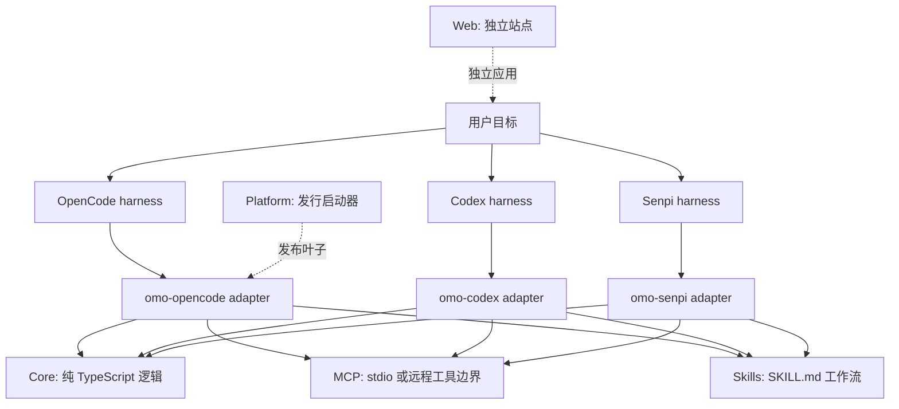
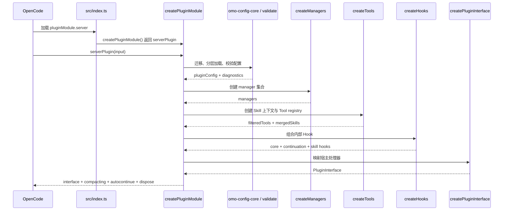
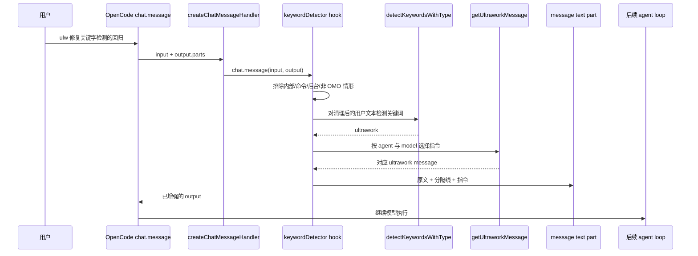
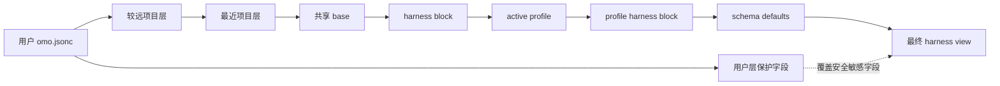

# 从零读懂复杂开源项目：以 OMO 为例的课程式学习指南

> 这不是一份“把所有目录介绍一遍”的源码导览，而是一门可以重复使用的学习方法。你将先获得一张低分辨率地图，再沿真实执行路径逐步提高分辨率；最终既能解释当前 OMO，也能把同样的方法迁移到别的复杂仓库。

## 0. 读完你将得到什么

完成本指南后，你应该能够：

- 用自己的话解释 Git 仓库、worktree、monorepo、harness、adapter、Core、MCP、Skill、Tool 和 Hook；
- 画出 OMO 的产品、分层与三个主要 harness 适配面；
- 从 OpenCode 入口追到 managers、tools、hooks 和最终插件接口；
- 沿一次 `ulw` 输入追踪关键字检测与指令注入；
- 解释统一 `omo.json[c]` 配置的加载顺序，以及为什么项目配置不能覆盖某些用户级安全字段；
- 区分委派 `task`、实验性 `task_*`、Team Mode 的团队任务、Senpi task 记录与持续目标 `goal`；
- 面对陌生功能时，自己完成“概念 → 代码 → 任务 → 证据”的学习闭环；
- 判断自己何时只是“见过代码”，何时已经具备定位、解释、修改和迁移能力。

这份文档面向零基础读者。你只需要会打开终端、输入命令和阅读少量 TypeScript；不要求先会 OpenCode、Codex、Senpi 或 MCP。

### 本文的事实边界

OMO 正处在多 harness 重构期。本文遵循以下证据优先级：

1. 当前分支的源码和 `package.json`；
2. 与源码一致的现有指南和参考文档；
3. [ROADMAP](../ROADMAP.md) 中的设计意图；
4. 生成的 `AGENTS.md` 只用于导航。

因此本文刻意不写死包、Hook、Tool、Agent、模型或 Codex 组件的数量。它们会变化；入口、边界、依赖方向和验证方法比某个快照数字更值得学习。一个尤其重要的漂移是：ROADMAP 仍保留“OpenCode 尚未采用 `omo.json`”的旧阶段描述，但当前源码已经通过 [`omo-config-chain.ts`](../packages/omo-opencode/src/plugin-config/omo-config-chain.ts) 接入 [`omo-config-core`](../packages/omo-config-core/src/loader/loader.ts)。遇到类似冲突，应以当前源码为准，同时把 ROADMAP 当作“为什么这样设计”的材料，而不是现状清单。

---

## 1. 开始之前：安全契约与最小词汇表

### 1.1 零基础安全契约

本指南的十节核心课程全部是只读探索：

- 不安装依赖；
- 不登录任何服务；
- 不改 `omo.json[c]`、Git 配置或环境变量；
- 不启动 OpenCode、Codex、Senpi 或任何 MCP 服务；
- 不运行可能写缓存、状态或生成物的构建与测试；
- 不编辑仓库文件、不提交、不推送。

所有命令都从仓库根目录运行，并标注为“只读”。命令输出可能因版本演进而略有不同，你要观察结构和关系，而不是死记数量。学习证据请写在纸上、个人笔记应用或仓库外的临时笔记中，不要在项目目录内新建文件。

如果命令中出现 `sed`、`rg`、`find`、`git status`，它们在本文用法中只读取内容。`rg` 是 ripgrep；若系统没有它，可以先阅读链接的文件，不必为了课程安装软件。

### 1.2 词汇表

| 术语 | 零基础解释 | 在 OMO 中怎么看 |
|---|---|---|
| Git | 记录文件版本、分支和提交历史的版本控制系统。 | `git status` 告诉你工作区是否有未提交变化。 |
| repository / repo（仓库） | 由 Git 管理的一整棵项目目录，包含源码、文档和历史。 | 仓库根目录由 `git rev-parse --show-toplevel` 得到。 |
| worktree（工作树） | 同一 Git 仓库的一个独立检出目录，可在不同分支并行工作。 | 贡献改动应在任务专属 worktree 中完成，避免污染主检出。 |
| monorepo（单体仓库） | 一个仓库容纳多个彼此相关的包或应用。 | 根 [`package.json`](../package.json) 的 `workspaces` 指向多个 `packages/*`。 |
| package（包） | 有明确名称、依赖和导出边界的可构建单元。 | 例如 `omo-config-core`、`omo-opencode`、`omo-senpi`。 |
| harness（宿主/执行框架） | 真正承载 agent 会话、模型循环、工具调用和生命周期事件的运行环境。 | OpenCode、Codex、Senpi 是不同 harness。 |
| adapter（适配器） | 把共享能力翻译成某个 harness API 的薄层。 | `omo-opencode`、`omo-codex`、`omo-senpi`。 |
| Core（核心层） | 与具体 harness 无关的纯逻辑，适合独立测试和复用。 | `omo-config-core`、`rules-engine`、`team-core` 等。 |
| MCP | Model Context Protocol；通常通过进程或远程边界向宿主暴露工具的协议。 | `lsp-daemon`、`git-bash-mcp`，以及 Codex 的 `.mcp.json`。 |
| Skill（技能） | 给 agent 阅读的声明式知识或工作流程，通常以 `SKILL.md` 表达。 | `packages/shared-skills/skills/` 与适配器内置技能。 |
| Tool（工具） | agent 可以带结构化参数调用的运行时能力。 | OpenCode 的 `grep`、`task`、条件注册的 `team_*` 等。 |
| Hook（钩子） | 在宿主生命周期的特定时点执行逻辑。 | `chat.message`、`tool.execute.before`、`PostToolUse` 等。 |
| schema（模式） | 对配置或数据形状的可执行约束：允许哪些字段、类型和默认值。 | `omo-config-core` 和 OpenCode 配置使用 schema 校验。 |
| shim（垫片/兼容层） | 保留旧导入位置或补齐兼容行为的薄包装。 | Core 抽取期间，适配器原位置可保留 re-export shim。 |
| test（测试） | 自动检查一个较小范围行为是否符合预期。 | 单元测试可验证解析、路由或工具工厂。 |
| QA（质量验证） | 从真实使用表面证明系统行为；范围通常比单元测试更接近宿主。 | 本仓库要求涉及 harness 的改动驱动真实 harness，并把证据写入 `.omo/evidence/`。 |

一个常见混淆是“测试通过 = QA 完成”。在本项目中不成立：类型检查和单元测试证明局部契约，真实 harness QA 证明集成路径确实工作，两者都重要但不能互相替代。

---

## 2. 可迁移的方法：把仓库重新编排成课程

复杂仓库的目录结构服务于构建、发布和团队协作，不会自动按初学者的认知顺序排列。因此：

> Repository Structure ≠ Learning Structure（仓库结构不等于学习结构）。

### 2.1 从结果能力倒推，而不是从目录顺序出发

不要把课程设计成“今天看 `agents/`，明天看 `tools/`”。先定义学完后能做什么：

| 阶段 | 能力结果 | 可验证产物 |
|---|---|---|
| 方向感 | 说清项目解决什么问题、有哪些边界 | 一分钟口述 + 低分辨率地图 |
| 运行性理解 | 知道真实系统如何启动和被观察 | 只读阶段先做源码执行图；贡献阶段再做隔离 QA |
| 架构理解 | 解释入口、Core、适配器、外部进程的关系 | 分层图与依赖箭头 |
| 路径追踪 | 沿一个用户行为走到结果 | 序列图、关键函数清单 |
| 定位能力 | 新问题出现时知道先搜哪里 | 搜索假设与证据链 |
| 修改能力 | 在边界内改变已有行为 | 失败先行测试、补丁、真实 QA |
| 重建与迁移 | 不照抄源码也能表达核心思想 | 简化设计或新场景架构提案 |

### 2.2 先画低分辨率地图

初读只回答五个问题：

1. 产品为谁解决什么问题？
2. 哪些是宿主，哪些是 OMO 自己的代码？
3. 哪些逻辑可跨宿主复用？
4. 一次输入大致经过哪些阶段？
5. 哪些事实容易随版本变化？

这一阶段允许“粗，但不能错”。例如，“OpenCode 适配器会创建工具和 Hook”是合格地图；“它固定有 N 个工具”是脆弱记忆。

### 2.3 用纵向切片代替横向扫目录

纵向切片从一个真实触发点出发，穿过多个模块直到可观察结果。本文选择两个真实切片：

- OpenCode 插件 bootstrap：从 `src/index.ts` 到返回宿主 Hook 表；
- `ulw`：从用户文本到关键字识别、模型/agent 路由和指令注入。

切片的价值在于同时看到“谁调用谁”和“为什么需要边界”。横向扫目录往往只得到孤立文件名。

### 2.4 学习的最小单位：Concept × Code × Task

每个单元都要有三条腿：

- **Concept**：一个可说清的问题，例如“Hook 与 Tool 的区别是什么？”
- **Code**：真实入口、关键函数和相邻测试；
- **Task**：一个可以执行和核对的观察任务。

只有概念会漂浮；只有代码会迷路；只有任务会变成复制粘贴。三者相乘才形成可迁移能力。

### 2.5 只读阶段也要形成 Runnable Learning Loop

本指南的闭环不是启动 harness，而是运行可重复的只读查询：

```text
提出问题 → 预测会在哪 → 运行搜索/阅读命令 → 记录观察
     ↑                                      ↓
     └──────── 自我解释差异并修正地图 ────────┘
```

进入贡献阶段后，这个闭环再升级为：失败先行测试 → 实现 → 单元验证 → 隔离的真实 harness QA → 证据。

### 2.6 逐步撤掉脚手架（Guidance Fading）

1. **示范**：本文给出完整 bootstrap 和 `ulw` 路径。
2. **半引导**：课程给文件和问题，你找函数。
3. **问题驱动**：只给“Codex 如何声明 Hook？”之类的问题。
4. **受约束修改**：贡献阶段在一个边界内改行为。
5. **独立设计**：capstone 只给验收标准，由你组织证据。

目标不是永远“跟着答案走”，而是完成“看懂 → 补全 → 定位 → 修改 → 独立解释”。

### 2.7 执行前预测与自我解释

每次运行命令前先写一句预测：

> 我预计入口只做导入与导出，真正组装发生在 testing/create-plugin-module.ts。

再比较结果。预测错误不是失败，而是高价值信号：它暴露了心智模型和真实系统之间的差距。观察后至少回答：

- 为什么调用发生在这一层？
- 如果删除这一层，哪个依赖方向会被破坏？
- 同样能力为什么在另一个 harness 中形态不同？
- 这条结论来自源码、manifest、文档还是猜测？

---

## 3. OMO 的产品心智模型

### 3.1 一句话定位

OMO 是面向长时、可委派 agent 工作的能力层。它不是模型本身，也不是一个统一重写所有宿主的 agent loop；它把工作流、工具、规则、续作和多 agent 协调能力接入不同 harness。

[ROADMAP](../ROADMAP.md) 的核心意图是“人提出目标，agent 执行并完成”，并以 agent 完成复杂任务的表现作为架构取舍标准。[项目宣言](manifesto.md) 提供了更偏产品理念的阅读入口。

### 3.2 产品、edition、harness 与 adapter

把 OMO 想成一套产品能力，而不是一个单一可执行文件：

| 视角 | 当前对应物 | 初学者应该记住什么 |
|---|---|---|
| Ultimate / OpenCode edition | [`packages/omo-opencode`](../packages/omo-opencode/) | 最大的 OpenCode in-process 插件适配器；组装 managers、tools、hooks 和宿主接口。 |
| Light / Codex edition | [`packages/omo-codex`](../packages/omo-codex/) | 以 Codex 插件 manifest、生命周期 Hook、组件进程、Skill 和 MCP 组合能力。仓库/bin 身份与市场插件身份不要混为一谈。 |
| Senpi adapter | [`packages/omo-senpi`](../packages/omo-senpi/) | 将一组组件注册到 Senpi ExtensionAPI，并接入 `senpi-task`。 |
| Native distribution | [`packages/omo-native`](../packages/omo-native/) | 面向原生发行/启动的叶子产品面；不要把它等同于共享 Core。 |

**Harness 是宿主，adapter 是翻译层。** OpenCode、Codex、Senpi 各自提供不同生命周期和扩展 API；OMO 不假设它们完全相同。

### 3.3 六层地图

当前仓库的目标分层来自 ROADMAP，但具体包清单应以根 [`package.json`](../package.json) 和各包 manifest 为准。



六层含义：

| 层 | 边界 | 真实例子 | 判断问题 |
|---|---|---|---|
| Core | 不依赖具体 harness 的纯逻辑 | `omo-config-core`、`team-core`、`memory-core` | 换宿主后这段逻辑仍成立吗？ |
| MCP | 通过 stdio/网络形成外部工具边界 | `lsp-daemon`、`git-bash-mcp` | 能否作为独立服务被别的宿主调用？ |
| Skills | 静态、声明式知识 | `packages/shared-skills/skills` | 只是教 agent 如何做，还是必须运行代码？ |
| Adapters | 对接 harness 生命周期和 API | `omo-opencode`、`omo-codex`、`omo-senpi` | 是否在翻译宿主事件、工具或配置？ |
| Platform | 针对 OS/架构的发行产物 | `oh-my-opencode-<os>-<arch>` | 它是否只负责交付/启动而不被业务包导入？ |
| Web | 独立站点应用 | `packages/web` | 它是否拥有独立运行边界？ |

目标依赖方向是 adapter 使用 Core、MCP 和 Skills，Platform 与 Web 作为叶子存在。但重构中的代码会有刻意保留的过渡边：例如 OpenCode 适配器仍承担 Codex 安装/发行集成，Senpi 适配器使用 `senpi-task` 作为适配支持。看到“非完美 DAG”时先查是否为有意过渡，不要立即把它判作错误。

---

## 4. OpenCode 启动：从两行入口到完整插件接口

### 4.1 入口为什么很薄

[`packages/omo-opencode/src/index.ts`](../packages/omo-opencode/src/index.ts) 只做三件关键事：导入 `createPluginModule`、创建模块、导出 `server` 和默认模块。可测试的组装逻辑放在 [`src/testing/create-plugin-module.ts`](../packages/omo-opencode/src/testing/create-plugin-module.ts)。目录名中的 `testing` 不表示“仅测试使用”；当前生产入口确实调用这里的工厂。

这种结构让测试可以注入依赖并观察初始化顺序，同时保持真正入口稳定。

### 4.2 启动主线

以当前源码为准，主线可压缩为：

1. 安装 agent 排序 shim，初始化 OpenCode 配置上下文；
2. 执行旧工作区/旧配置迁移与统一配置校验；
3. 做重复插件、外部 Skill 插件冲突、安全头和进程卫生处理；
4. 应用 telemetry、TUI、live server route、运行时安全 Skill、i18n、agent 顺序等设置；
5. 按配置初始化 OpenClaw、Team Mode、tmux；
6. [`createManagers`](../packages/omo-opencode/src/create-managers.ts) 创建长生命周期管理器；
7. [`createTools`](../packages/omo-opencode/src/create-tools.ts) 建立 Skill 上下文和 Tool registry；
8. [`createHooks`](../packages/omo-opencode/src/create-hooks.ts) 组合核心、续作和 Skill Hook；
9. [`createPluginInterface`](../packages/omo-opencode/src/plugin-interface.ts) 把内部能力映射为宿主可见处理器；
10. 额外挂接 session compacting、compaction autocontinue 和 dispose，返回完整 Hook 表。



图中 `createHooks` 产生的是内部 Hook 对象；`createPluginInterface` 返回的是 OpenCode 宿主认识的处理器表。二者都叫 Hook 很容易混淆，下一节会专门拆开。

### 4.3 Managers、Tools、Hooks、Interface 各自负责什么

- **Managers**：维护跨事件的状态和资源，如 background、tmux、Skill MCP、monitor、TUI mirror、model fallback。
- **Tools**：读取 Skill 上下文，组装核心与条件工具，标准化参数 schema，再按禁用列表和上限过滤。
- **Internal Hooks**：按 session、tool guard、transform、continuation、skill 等职责创建可组合逻辑。
- **Plugin Interface**：把以上对象接到 OpenCode 的 `chat.message`、`event`、`tool.execute.before/after` 等正式扩展点。
- **Dispose**：停止运行时 Skill source，清理后台、MCP 和 Hook 资源。

---

## 5. Skill、MCP、Tool、Hook：四个名字，四种成本

ROADMAP 给出的表达优先级是 **Skill → MCP → Tool → Hook**。它不是“越后越高级”，而是提醒开发者：能用更低运行时耦合表达的能力，就不要过早侵入 agent loop。

| 机制 | 本质 | 谁读取/调用 | 运行边界 | 适合做什么 | OMO 例子 |
|---|---|---|---|---|---|
| Skill | Markdown 等声明式知识与流程 | agent 读取并遵循 | 通常无独立运行进程 | 教方法、约束工作流、按需加载知识 | `shared-skills/skills`、Team Mode/QA 技能 |
| MCP | 标准协议暴露的外部工具服务 | harness 的 MCP client | 本地 stdio 或远程网络 | 代码智能、可复用外部能力 | Codex `.mcp.json` 中的 LSP、codegraph、git-bash |
| Tool | 宿主直接暴露给 agent 的结构化调用 | agent 发起 tool call | adapter 进程内或宿主定义边界 | 一等运行能力、访问当前会话/manager | OpenCode `grep`、`task`、`create_goal` |
| Hook | 生命周期时点上的自动逻辑 | harness 在事件发生时调用 | 紧贴 agent loop | 前后置守卫、消息变换、续作、清理 | `chat.message`、`tool.execute.after`、Codex `PostToolUse` |

判断顺序可以这样问：

1. 只写清步骤，agent 就能正确完成吗？优先 Skill。
2. 需要独立、可跨宿主的程序能力吗？考虑 MCP。
3. 需要宿主内一等结构化调用和会话状态吗？考虑 Tool。
4. 必须在某个生命周期时点自动介入吗？才考虑 Hook。

### 5.1 “两层 Hook”陷阱

OpenCode 代码里有两种粒度：

- **宿主可见 Hook handler**：[`plugin-interface.ts`](../packages/omo-opencode/src/plugin-interface.ts) 返回给 OpenCode 的键，例如 `chat.message`、`tool.execute.before`；
- **内部 Hook factory**：[`create-hooks.ts`](../packages/omo-opencode/src/create-hooks.ts) 及 `plugin/hooks/` 创建的组合对象，例如 keyword detector、comment checker、continuation guard。

一个宿主 handler 会按明确顺序调用多个内部 Hook。调查行为时不能只搜同名目录，还要找“谁把它接到宿主事件上”。

---

## 6. 纵向切片：一条 `ulw` 消息如何改变上下文

假设用户在 OpenCode 主会话输入：

```text
ulw 修复关键字检测的回归
```

真实路径如下：

1. OpenCode 调用 `chat.message` handler；
2. [`plugin/chat-message.ts`](../packages/omo-opencode/src/plugin/chat-message.ts) 处理内部消息过滤、会话 agent、首条消息与模型状态，然后依次运行内部 Hook；
3. `hooks.keywordDetector["chat.message"]` 被调用；
4. [`detector.ts`](../packages/omo-opencode/src/hooks/keyword-detector/detector.ts) 去掉代码块，使用单词边界匹配 `ulw`/`ultrawork`，并尊重禁用/启用列表；
5. [`hook.ts`](../packages/omo-opencode/src/hooks/keyword-detector/hook.ts) 排除内部消息、slash command、非 OMO agent、后台任务等情形；
6. [`ultrawork/source-detector.ts`](../packages/omo-opencode/src/hooks/keyword-detector/ultrawork/source-detector.ts) 根据 agent/model 选择合适的指令源；
7. Hook 保留原始用户文本，在真实文本 part 后追加分隔线与 ultrawork 指令，并尝试显示激活 toast；
8. 后续 Hook 看到的是已经增强的消息；OpenCode 再把最终上下文送入 agent loop。



这条切片揭示了几个设计点：

- 检测器与注入策略分开，regex 不是整个功能；
- 代码块中的 `ulw` 不应误触发；
- planner、非 OMO agent、后台会话有不同策略；
- Prompt 正文在共享/专用资源中路由，adapter Hook 负责接入时机；
- `ulw` 关键字注入与 `ulw-execute`、`ulw-loop` 是相邻但不同的机制，不能只因名字相似就合并理解。

推荐的自我解释题：为什么不把 `ulw` 做成 Tool？因为它不是等待 agent 主动调用的能力，而是在用户消息进入循环时改变上下文的触发语义；这正符合 Hook 的时点特征。

---

## 7. 统一配置：`omo.json[c]` 到底谁覆盖谁

详细字段请看现有的 [`omo.json` 参考](reference/omo-json.md) 和 [OpenCode 配置参考](reference/configuration.md)；本节只建立解析模型，不复制易过期的大表。

### 7.1 文件层：用户最弱，最近项目最强

[`paths.ts`](../packages/omo-config-core/src/loader/paths.ts) 的搜索结果顺序是：

```text
~/.omo/omo.json[c]                         用户层
  ↓ 被更近层覆盖
祖先目录/.omo/omo.json[c]                  较远项目层
  ↓
...
  ↓
当前目录或最近祖先/.omo/omo.json[c]        最近项目层
```

项目搜索从当前目录向 home 走；home 自身的 `.omo` 只算用户层，不会再重复算项目层。每个目录优先选择 `omo.jsonc`，不存在时才选择 `omo.json`。项目配置路径还有符号链接防护。

### 7.2 视图层：base → harness → profile → profile.harness

所有文件层先按上面的顺序深度合并，再由 [`resolution.ts`](../packages/omo-config-core/src/loader/resolution.ts) 解析当前视图：

```text
共享 base
  ↓
[opencode] / [codex] / [senpi]
  ↓
profiles.<激活名称> 的共享字段
  ↓
profiles.<激活名称>.[当前 harness]
  ↓
schema defaults 补齐未设置值
```

后层覆盖前层；普通对象递归合并，标量和大多数数组整体替换。`codegraph.excluded_roots` 是显式的去重合并特例。危险对象键会被过滤以防原型污染。

Profile 名称优先级是：显式传入参数 → `OMO_PROFILE` → `OCX_PROFILE` → `OPENCODE_CONFIG_DIR` 末尾的 `profiles/<name>` → 无 profile。不存在的 profile 会产生诊断并退回 base，而不是凭空创建。

### 7.3 OpenCode 的当前接入与安全例外

当前 OpenCode 并非继续使用互不相干的旧配置链：

- [`omo-config-chain.ts`](../packages/omo-opencode/src/plugin-config/omo-config-chain.ts) 调用 `loadOmoConfig`，为每个物理层构造 base、`[opencode]`、profile base、profile `[opencode]` 视图；
- [`config/validate.ts`](../packages/omo-opencode/src/config/validate.ts) 用 OpenCode schema 逐节校验、合并并应用兼容迁移；
- 旧的 `oh-my-openagent.json[c]`、`oh-my-opencode.json[c]` 和旧 `~/.omo/config.jsonc` 属于迁移输入，不再是日常读取链。

两个 OpenCode 字段被刻意限制为仅信任用户层（包括用户层激活 profile 的 `[opencode]` 块）：

- `mcp_env_allowlist`；
- `browser_automation_engine.playwright_mcp_args`。

项目层不能扩展这两个字段，因为克隆来的仓库不应获得替用户放行环境变量或添加浏览器进程参数的权力。这是“配置优先级”之外的安全不变量。

### 7.4 配置解析图



---

## 8. 三个 harness：共享意图，不强求相同形状

| 维度 | OpenCode | Codex Light | Senpi |
|---|---|---|---|
| 主入口形态 | TypeScript `PluginModule.server` | `.codex-plugin/plugin.json` manifest | Senpi extension 默认导出 |
| 组装方式 | 进程内创建 managers、tools、hooks、interface | manifest 声明 Skills、Hook JSON、MCP；组件各自构建/执行 | `composeOmoSenpiExtension` 依次注册组件 |
| 生命周期语言 | `chat.message`、`event`、`tool.execute.*` 等 | `SessionStart`、`UserPromptSubmit`、`PreToolUse`、`PostToolUse`、`Stop` 等 | ExtensionAPI 的事件、flag、tool、command 注册 |
| Tool/MCP | adapter 内 Tool registry + 内置/外部 MCP | [`.mcp.json`](../packages/omo-codex/plugin/.mcp.json) 列 MCP，Hook/组件补充行为 | 组件直接向 `pi.registerTool` 注册，LSP/AST 等组件接入运行时 |
| 配置 | `omo-config-core` + OpenCode schema/保护字段 | shared config loader 使用 `omo-config-core` 并加入 Codex 信任边界 | config-resolution 包装 `loadOmoConfig`，task 组件消费解析结果 |
| task/team | OpenCode 委派、实验任务记录、Team Mode 分立 | teammode 以 Codex 组件/Skill/脚本表达，不能假设有 OpenCode 的 `team_*` 工具 | `senpi-task` 提供任务状态、团队和 DAG 运行时 |
| QA 边界 | 必须驱动隔离 OpenCode | 隔离 `CODEX_HOME` + 本地 mock model 的真实 app-server | 隔离 agent dir，驱动真实 Senpi binary |

三个重要观察：

1. **共享的是能力意图，不是宿主 API 名字。** “工具后检查”在不同宿主中会表现为不同事件和载荷。
2. **Codex manifest 是学习入口。** [`plugin.json`](../packages/omo-codex/plugin/.codex-plugin/plugin.json) 明确列出 Skills、Hook 文件和 MCP 配置；组件实际清单以 [`plugin/package.json`](../packages/omo-codex/plugin/package.json) 的 workspaces 和当前目录为准。
3. **Senpi 是组件组合。** [`component-list.ts`](../packages/omo-senpi/src/extension/component-list.ts) 构造组件序列，[`compose.ts`](../packages/omo-senpi/src/extension/compose.ts) 检查 ExtensionAPI、安装共享协调器并逐个注册，单个组件失败不会让整条注册循环无条件崩溃。

不要急着设计一个“所有 Hook 都一样”的万能接口。[ROADMAP](../ROADMAP.md) 明确对过早统一持怀疑态度：高速变化的宿主接口上，错误抽象可能比有限重复更贵。

---

## 9. Task、Team、Goal：相似词背后的不同状态机

这是 OMO 初学者最容易踩的名字碰撞区。

| 名称 | 解决的问题 | 生命周期/状态 | 主要代码入口 | 不要误认为 |
|---|---|---|---|---|
| OpenCode `task` | 把一项工作委派给子 agent/category，可前台或后台执行 | 与子会话、background manager 相关 | `tools/delegate-task/`，由 core tool registry 注册 | 不是待办数据库 CRUD |
| `call_omo_agent` | 受限地调用特定查询型 OMO agent | 子会话调用 | `tools/call-omo-agent/` | 不是通用 team member 管理 |
| OpenCode `task_*` | 实验性的持久任务记录 CRUD | `pending` 等任务记录状态，可与 todo 同步 | [`tools/task/`](../packages/omo-opencode/src/tools/task/)，由 `experimental.task_system` 控制 | 不是委派 `task` 的别名 |
| OpenCode `team_*` / team task | 管理团队、成员、mailbox 和团队共享任务列表 | team run + task list + member 状态 | [`features/team-mode`](../packages/omo-opencode/src/features/team-mode/) 与 `team-core` | 不是单次 background task |
| Senpi task record | Senpi 的子任务执行、持久化、消息与恢复 | `senpi-task` 的 task 状态机和 store | [`packages/senpi-task/src`](../packages/senpi-task/src/) | 不与 OpenCode 实验 `task_*` 共用同一实现 |
| Senpi DAG | 带依赖前沿的多节点任务图 | node、run、依赖、重试/取消/恢复 | `senpi-task/src/dag/`，由 Senpi task 组件注册 `dag` | 不是简单 team task list |
| Goal | 让主工作在宿主 idle/停止边缘继续，直至暂停或完成；记录使用量，部分适配面还支持预算 | 一个活动目标及其状态、使用量 | [`hooks/goal`](../packages/omo-opencode/src/hooks/goal/)；Pi/Codex 对齐逻辑在 [`pi-goal`](../packages/pi-goal/) | 不是一组可并行分配的子任务 |

可以用三个问题快速分类：

- “谁来做这项工作？”——委派 `task` 或 team。
- “工作如何分解、依赖和记录？”——task record、team task 或 DAG。
- “主会话为什么还不能停？”——goal / continuation。

Team 可以包含任务，Goal 可以驱动 agent 创建任务，但包含关系不代表它们是同一个状态系统。

---

## 10. 从 ROADMAP 学设计哲学，而不是抄状态数字

### 10.1 面向自主完成，而不是只优化小任务

OMO 的产品假设是：人给出目标后，不应持续替 agent 补齐每个细节。于是系统重视续作、验证、委派、状态恢复和证据，而不只是一次 prompt 的回答质量。

### 10.2 按运行时边界分层

Core、MCP、Skills、Adapters、Platform、Web 不是“文件夹审美”，而是运行边界：纯逻辑能独立测试，MCP 有进程协议，Skill 是静态知识，adapter 才接触宿主 API。边界降低了迁移 harness 时的重复成本。

### 10.3 Skill → MCP → Tool → Hook

选择需要 agent 最少推理、系统最少耦合的表达。静态知识不要无故写成常驻进程；跨宿主工具不必绑死某个 adapter；不要求自动介入生命周期的能力不要做 Hook。

### 10.4 不提前制造万能 adapter

多个 harness 都有“前置工具事件”，不代表它们的错误语义、会话模型和时序保证相同。当前策略是先抽取已经稳定的纯逻辑，对不稳定连接点保持具体实现。

### 10.5 行为保持式抽取

重构理想路径是：把逻辑移到 Core → 原位置保留 shim/re-export → 证明行为不变 → 再删除重复。这样迁移是可验证的小步，而不是把架构愿景一次性重写成现实。

### 10.6 最少推理表示

ROADMAP 的决策原则是：优先采用让执行任务的 agent 需要最少推理的表示。这可能让目录对人类不够“漂亮”。学习者应先理解运行约束，再提出整理建议；不要把人类浏览体验自动放在 agent loop 正确性之前。

### 10.7 漂移检查习惯

阅读设计文档时为每条“当前”断言加一个检查：

- 包清单：看根 workspace 与包 manifest；
- 启动顺序：看生产入口与工厂；
- Tool/Hook：看 registry/interface，而不是生成统计；
- 配置：看 loader、resolution、adapter validation；
- 产品名与发布别名：看当前 manifest 和发布脚本；
- 路线意图：再回到 ROADMAP 理解取舍。

---

## 11. 十节只读课程：从方向感到独立项目地图

### 课程使用规则

每课都包含目标、命令、预期观察、预测题、证据任务。所有命令均为**只读**，从仓库根目录运行。不要为了让输出与本文逐字相同而切换分支或修改配置。

### Lesson 1：确认你站在哪里

**目标**：区分仓库根、当前分支和工作区状态。

**只读命令**：

```bash
pwd
git rev-parse --show-toplevel
git branch --show-current
git status --short
```

**预期观察**：前两条应指向同一仓库根；分支名告诉你正在观察哪个版本；空的 `git status --short` 表示无未提交变化，非空则只说明已有变化，不能擅自删除。

**执行前预测**：`pwd` 与 Git 根是否一定相同？如果你在 `packages/omo-opencode` 中运行，它们会怎样不同？

**证据任务**：在外部笔记写下“仓库、分支、工作树”各一句定义，并记录当前分支名。

### Lesson 2：从产品意图到事实来源

**目标**：学会同时阅读愿景与当前 manifest。

**只读命令**：

```bash
sed -n '1,220p' ROADMAP.md
sed -n '1,180p' package.json
rg -n 'workspaces|omo-config-core|memory-core|omo-opencode|omo-codex|omo-senpi' package.json ROADMAP.md
```

**预期观察**：ROADMAP 解释自主完成、分层和反对过早统一；`package.json` 给出当前 workspace 事实。你会看到配置接入或包清单等现状可能比 ROADMAP 的阶段文字更前进。

**执行前预测**：如果两者冲突，你应保留哪一个作为“现状”，哪一个作为“意图”？

**证据任务**：写两列：`current fact` 与 `design intent`，各摘录三个不含固定数量的结论。

### Lesson 3：画出 monorepo 的低分辨率地图

**目标**：只识别运行边界，不逐目录钻研。

**只读命令**：

```bash
find packages -mindepth 1 -maxdepth 1 -type d -print | sort
rg -n '"name"|"dependencies"|"peerDependencies"' packages/omo-opencode/package.json packages/omo-codex/package.json packages/omo-senpi/package.json packages/omo-native/package.json
find packages/shared-skills/skills -mindepth 1 -maxdepth 1 -type d -print | sort
```

**预期观察**：`packages/` 是多类型包的平铺目录；名字本身只是线索，依赖和入口才决定层。适配器依赖 Core/支持包，shared-skills 主要承载声明式工作流。

**执行前预测**：`omo-native` 更像 Core 还是发行叶子？你准备用什么证据判断？

**证据任务**：画不超过 12 个节点的六层图，每个箭头旁写“导入”“协议”或“发布”。

### Lesson 4：重建 OpenCode bootstrap

**目标**：从薄入口追到最终 Hook 表。

**只读命令**：

```bash
sed -n '1,120p' packages/omo-opencode/src/index.ts
rg -n 'serverPlugin|loadConfigChain|createManagers|createTools|createHooks|createPluginInterface|experimental.session.compacting|dispose' packages/omo-opencode/src/testing/create-plugin-module.ts
sed -n '300,430p' packages/omo-opencode/src/testing/create-plugin-module.ts
```

**预期观察**：`index.ts` 很薄；实际顺序在 `serverPlugin` 中。最终对象在 `pluginInterface` 之外追加 compacting、autocontinue 与 dispose。

**执行前预测**：为什么 `createTools` 必须在 `createHooks` 前完成？提示：Hook 创建参数使用了哪些 Skill 信息？

**证据任务**：不看本文图，凭源码手画一次 bootstrap 序列，并为每一步标出输入/输出。

### Lesson 5：分辨宿主 Hook 与内部 Hook

**目标**：找出两层 Hook 的装配点和调用顺序。

**只读命令**：

```bash
sed -n '1,260p' packages/omo-opencode/src/plugin-interface.ts
sed -n '1,240p' packages/omo-opencode/src/create-hooks.ts
sed -n '1,220p' packages/omo-opencode/src/plugin/hooks/create-transform-hooks.ts
rg -n 'runChatMessageHooks|keywordDetector|thinkMode|claudeCodeHooks' packages/omo-opencode/src/plugin/chat-message.ts
```

**预期观察**：`plugin-interface.ts` 暴露宿主事件；`create-hooks.ts` 合并内部集合；`chat-message.ts` 明确串行调用若干内部 Hook。相同能力是否生效取决于“创建 + 接线 + 配置门控”。

**执行前预测**：只实现一个 `createXHook()` 而不把它接入 handler，会发生什么？

**证据任务**：选择 keyword detector，写出“工厂 → 集合 → handler → 宿主键”四跳链。

### Lesson 6：独立复原 `ulw` 切片

**目标**：练习从触发文本追到消息变换与测试证据。

**只读命令**：

```bash
sed -n '1,180p' packages/omo-opencode/src/hooks/keyword-detector/constants.ts
sed -n '1,220p' packages/omo-opencode/src/hooks/keyword-detector/detector.ts
sed -n '1,280p' packages/omo-opencode/src/hooks/keyword-detector/hook.ts
rg -n 'standalone.*ulw|partial.*ulw|system-reminder|planner agent' packages/omo-opencode/src/hooks/keyword-detector/*.test.ts
```

**预期观察**：`\b` 防止 `ulw` 成为单词内部误匹配；代码块会被移除；Hook 还有内部消息、命令、agent、会话类别和重复注入守卫；测试覆盖正反例。

**执行前预测**：文本 `` `ulw` `` 与 `please ulw fix this` 是否都触发？先写答案再读 detector。

**证据任务**：列出三个“检测到但仍不注入”或“根本不检测”的守卫，并给出对应源码位置。

### Lesson 7：推导统一配置优先级

**目标**：把“文件层”和“视图层”分开理解。

**只读命令**：

```bash
sed -n '1,220p' packages/omo-config-core/src/loader/paths.ts
sed -n '1,240p' packages/omo-config-core/src/loader/loader.ts
sed -n '1,220p' packages/omo-config-core/src/loader/resolution.ts
rg -n 'protectedUserView|mcp_env_allowlist|playwright_mcp_args' packages/omo-opencode/src/plugin-config/omo-config-chain.ts packages/omo-opencode/src/config/validate.ts
```

**预期观察**：用户层先进入合并，项目层从远到近覆盖；解析视图再应用 harness 与 profile；defaults 最后补齐。OpenCode 重新从用户层提取两个受保护字段。

**执行前预测**：最近项目的 profile `[opencode]` 是否能覆盖用户的 `mcp_env_allowlist`？为什么？

**证据任务**：用两个独立箭头画“物理文件合并”和“逻辑视图解析”，再用虚线标出安全例外。

### Lesson 8：比较 Codex 与 Senpi 的接入形态

**目标**：看到同一产品能力如何适应不同宿主。

**只读命令**：

```bash
sed -n '1,260p' packages/omo-codex/plugin/.codex-plugin/plugin.json
sed -n '1,220p' packages/omo-codex/plugin/.mcp.json
sed -n '1,220p' packages/omo-senpi/src/extension/index.ts
sed -n '1,260p' packages/omo-senpi/src/extension/component-list.ts
sed -n '1,300p' packages/omo-senpi/src/extension/compose.ts
```

**预期观察**：Codex 从 manifest 看见 Skills、Hook 文件和 MCP；Senpi 默认导出组合后的 extension，并通过组件列表/注册循环接入能力。两者没有强行复用 OpenCode 的 `PluginInterface`。

**执行前预测**：Codex 的 LSP 更适合从 manifest 的 Hook 列表还是 `.mcp.json` 首先定位？然后如何寻找与它相邻的 Hook？

**证据任务**：为 OpenCode、Codex、Senpi 各写一句“宿主如何发现 OMO”。

### Lesson 9：拆开 Task、Team、Goal

**目标**：依据 registry 和状态所有权消除名字碰撞。

**只读命令**：

```bash
sed -n '1,240p' packages/omo-opencode/src/plugin/tool-registry.ts
sed -n '1,220p' packages/omo-opencode/src/plugin/tool-registry-gated-tools.ts
sed -n '1,220p' packages/omo-opencode/src/plugin/tool-registry-team-tools.ts
rg -n 'createGoalTools|goal.enabled|createTaskTool|registerDagTool' packages/omo-opencode/src/plugin packages/omo-opencode/src/hooks/goal packages/omo-senpi/src/components/task packages/senpi-task/src/tools
```

**预期观察**：核心委派工具、实验 `task_*`、team 工具和 goal 工具从不同工厂与配置门进入 registry；Senpi task 组件又有自己的 Tool 与 DAG 注册。

**执行前预测**：启用 `experimental.task_system` 是否应该自动启用 Team Mode？用 registry 组合方式证明答案。

**证据任务**：为每套状态写出“创建者、存储/manager、终止条件”三项；找不到的项明确标成待查，不要猜。

### Lesson 10：Capstone——独立制作一个功能地图

**目标**：撤掉逐文件引导，独立追踪一个真实能力。推荐从 `grep`、rules injection、comment checker、LSP 或 memory 中选一个。

**只读命令模板**（把 `<keyword>` 换成你选的源码标识；尖括号不要原样输入）：

```bash
rg -n '<keyword>' packages/omo-opencode/src packages/omo-codex/plugin packages/omo-senpi/src packages/*-core/src
rg --files | rg '<keyword>|AGENTS.md|package.json|test'
git log --oneline --all -- '<你定位到的路径>'
git blame -L 1,120 -- '<一个关键文件>'
```

**预期观察**：同一能力可能横跨 Core、adapter、Hook/Tool 注册和测试；历史命令帮助理解“为什么”，但提交信息不能替代当前源码。若路径不存在，先用 `rg --files` 校正假设。

**执行前预测**：它最可能以 Skill、MCP、Tool 还是 Hook 表达？可能同时占几层？

**Capstone 验收证据**：在仓库外完成一页项目地图，必须包含：

1. 一个用户可观察触发点；
2. 一个生产入口；
3. 一条至少四跳的真实调用/数据路径；
4. 一个配置门或安全边界；
5. 两个测试：一个正例、一个失败/排除路径；
6. 一个不超过 20 节点的 Mermaid 图；
7. 三条带源码相对路径的结论；
8. 一条尚未确认的不确定性及下一步只读验证命令。

如果你能在不复制本文答案的情况下完成，并向另一位初学者讲清楚，就已经从“浏览代码”进入“独立定位”。

---

## 12. 贡献者续篇：当你准备真正修改代码

到这里核心只读课程结束。下面的动作会写文件或启动 harness，只在你明确承担贡献任务、阅读仓库最新规则后进行。

### 12.1 先缩小影响面

1. 阅读根 `AGENTS.md`、目标目录下最近的 `AGENTS.md` 和 [CONTRIBUTING](../CONTRIBUTING.md)；
2. 阅读 [ROADMAP](../ROADMAP.md)，再用当前源码校准现状；
3. 沿生产入口、registry、schema、测试追完整调用链；
4. 在任务专属 worktree 中写磁盘计划和原子 todo；
5. 先构造能诚实失败的测试或验证观察，再修改实现。

### 12.2 QA 按所触及的 harness 分域

| 改动范围 | 必须补充的真实表面 QA | 核心隔离要求 |
|---|---|---|
| `packages/omo-opencode/` | 使用仓库的 `opencode-qa` 流程，选择 CLI、server/SSE、TUI 或 DB 用例 | 隔离 XDG 目录，证明真实 OpenCode session DB 未污染 |
| `packages/omo-codex/` | 使用 `codex-qa`，驱动真实 `codex app-server` 和本地 mock model | 隔离 `CODEX_HOME`，证明真实 `~/.codex/config.toml` 未改变 |
| `packages/omo-senpi/` 或 `packages/senpi-task/` | 使用 `senpi-qa` 驱动真实 Senpi binary | 使用规定的隔离 agent dir 和 evidence 路径，证明真实 Senpi 目录未改变 |

只改纯 Core 时也要运行与影响面匹配的单元/类型验证；若 adapter 消费路径受影响，还应补相应真实 harness QA。不要因为改动行数少就跳过。

### 12.3 证据不是“我运行过”

每份 QA 证据至少回答：

- **What was tested**：命令、真实表面、要证明的行为；
- **What was observed**：实际前后行为、隔离证明、原始输出位置；
- **Why it is enough**：覆盖了哪条风险，为什么足够；
- **What was omitted**：哪些 secret、token、auth header 或私密日志被删减。

测试绿但没有真实表面证据，不满足本仓库的 adapter QA 要求；有截图但没有命令、预期和隔离证明，也不构成可复核证据。

### 12.4 PR 前的最小交付链

```text
探索 → 磁盘计划 → 细化 todo → 新 worktree → 失败先行证据
→ 实现 → 单元/类型验证 → 对应 harness QA → .omo/evidence
→ reviewer-readable PR → CI/审查修复 → 重新 QA → 按仓库策略合并
```

安装、完整配置字段和用户功能请直接阅读维护中的文档，而不是从本文复制旧表：

- [安装指南](guide/installation.md)
- [二进制安装](guide/binary-install.md)
- [编排指南](guide/orchestration.md)
- [Team Mode](guide/team-mode.md)
- [Senpi Task](guide/senpi-task.md)
- [CLI 参考](reference/cli.md)
- [功能参考](reference/features.md)
- [已知问题](reference/known-issues.md)

---

## 13. 常见反模式与修正动作

| 反模式 | 为什么危险 | 立刻改成 |
|---|---|---|
| 按目录从 A 读到 Z | 文件彼此孤立，没有执行上下文 | 选一个用户触发点做纵向切片 |
| 一开始追求所有细节 | 工作记忆被类型和分支淹没 | 先画不超过 12 节点的低分辨率图 |
| 把生成 `AGENTS.md` 当唯一事实 | 统计和描述可能滞后 | 用它导航，再查 source/manifest |
| 抄 ROADMAP 的“当前数量/状态” | 路线文档会滞后于落地 | 意图看 ROADMAP，现状看源码 |
| 搜到同名就认定同一系统 | `task`、team task、Senpi task 会被混为一谈 | 比较创建者、存储、状态机和 registry |
| 只读源码，不执行查询 | 形成不可重复的模糊印象 | 每个结论配一条只读命令和观察 |
| 只运行 demo，不追内部路径 | 只会使用，不会定位 | 触发 → registry → handler → state/test |
| 大量复制命令但不预测 | 输出正确也未形成模型 | 命令前写预测，命令后解释差异 |
| 把 Skill、MCP、Tool、Hook 当层级称号 | 会选择过重的实现机制 | 按知识、进程、调用、生命周期边界判断 |
| 看到重复就抽象所有 harness | 不同宿主时序和错误语义可能不兼容 | 只抽取已稳定的纯逻辑 |
| 类型检查或单测绿就宣布 QA 完成 | 没证明真实宿主接线 | 按 adapter 运行隔离 harness QA 并落证据 |
| 在主检出直接改 | 与已有工作混杂，难隔离和清理 | 使用任务专属 worktree |
| 用“读了多少文件”衡量掌握 | 阅读量不等于定位与迁移能力 | 用下面的 mastery rubric 自测 |

---

## 14. 掌握度量表

每项给自己 0～3 分：

- **0：未接触**——不知道从哪里开始；
- **1：在提示下完成**——给出文件和命令后能复述；
- **2：独立完成**——只给问题就能找到证据并解释；
- **3：可迁移/可评审**——能发现漂移、比较替代设计、指导别人或安全修改。

| 能力维度 | 自测问题 |
|---|---|
| 术语 | 能否不循环定义地解释 harness、adapter、MCP、Tool、Hook？ |
| 产品模型 | 能否解释 Ultimate/OpenCode、Light/Codex、Senpi/native 的关系而不混淆名称？ |
| 分层 | 能否给一个包分类，并用依赖/运行边界而不是名字证明？ |
| 启动路径 | 能否从 `index.ts` 画到 OpenCode 返回的 Hook 表？ |
| 机制选择 | 给定新能力，能否论证用 Skill、MCP、Tool 还是 Hook？ |
| 纵向追踪 | 能否独立追一条至少四跳的真实功能路径？ |
| 配置 | 能否分别说明物理文件层、harness/profile 视图层和用户安全字段？ |
| 跨 harness | 能否比较同一能力在 OpenCode、Codex、Senpi 中的接法？ |
| 状态建模 | 能否区分委派 task、任务记录、team、DAG 和 goal？ |
| 证据意识 | 每条关键结论能否指出 source/manifest/test？ |
| 贡献安全 | 能否为改动选择正确 worktree、测试、真实 QA 和证据目录？ |
| 迁移能力 | 离开 OMO 后，能否用同样方法拆解另一个 monorepo？ |

建议里程碑：

- 多数为 1 分：你已经具备导航能力；
- 多数为 2 分：你可以独立调查问题；
- 关键项达到 3 分：你可以承担边界清晰的贡献或评审；
- “证据意识”和“贡献安全”未到 2 分时，不要独立修改 harness 接线。

真正的终点不是“我读完了源码”，而是：

> 给我一个 OMO 问题，我知道去哪里验证、如何解释边界、怎样安全改动；给我另一个复杂项目，我仍能从低分辨率地图、纵向切片和证据闭环开始。

---

## 15. 下一步阅读地图

### 如果你想理解产品和使用方式

- [概览](guide/overview.md)
- [编排](guide/orchestration.md)
- [Agent 与模型匹配](guide/agent-model-matching.md)
- [项目宣言](manifesto.md)

### 如果你想理解配置与功能面

- [`omo.json` 参考](reference/omo-json.md)
- [OpenCode 配置参考](reference/configuration.md)
- [功能参考](reference/features.md)
- [Monitor](reference/monitor.md)

### 如果你想理解多 agent 与长任务

- [Team Mode 指南](guide/team-mode.md)
- [Senpi Task 指南](guide/senpi-task.md)
- [Mass ULW protocol](reference/mass-ulw-protocol.md)
- [异步 prompt gate RFC](reference/prompt-async-gate-rfc.md)

### 如果你想理解分层重构

- [ROADMAP](../ROADMAP.md)
- [Shared Core multi-PR 说明](reference/shared-core-multi-pr.md)
- [re-export shim inventory](reference/re-export-shim-inventory.md)
- [跨模块 rules injection 比较](reference/rules-injection-cross-module-comparison.md)

### 如果你准备贡献

- [CONTRIBUTING](../CONTRIBUTING.md)
- 目标路径最近的 `AGENTS.md`
- 根 `AGENTS.md` 中当前的 worktree、QA、证据与合并要求
- 对应 `opencode-qa`、`codex-qa` 或 `senpi-qa` Skill 的最新 `SKILL.md`

### 每次更新这份心智模型时

1. 用 source/manifest 重新验证入口与组件清单；
2. 检查 ROADMAP 的状态描述是否已经漂移；
3. 不更新固定数量，除非数量本身就是被测试的契约；
4. 重新核对本地链接与 Mermaid 节点；
5. 对每个新名词补“所有者、边界、生命周期”；
6. 保持示范课程只读，把安装、启动和修改留在明确的贡献阶段。

这套检查表也是方法论的最后一课：复杂项目永远会变化，真正耐用的不是一张静态地图，而是你持续校准地图的能力。
