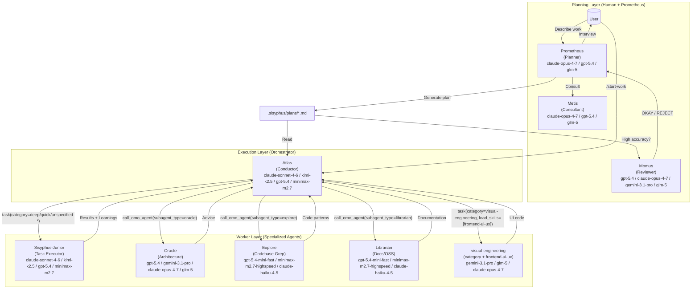
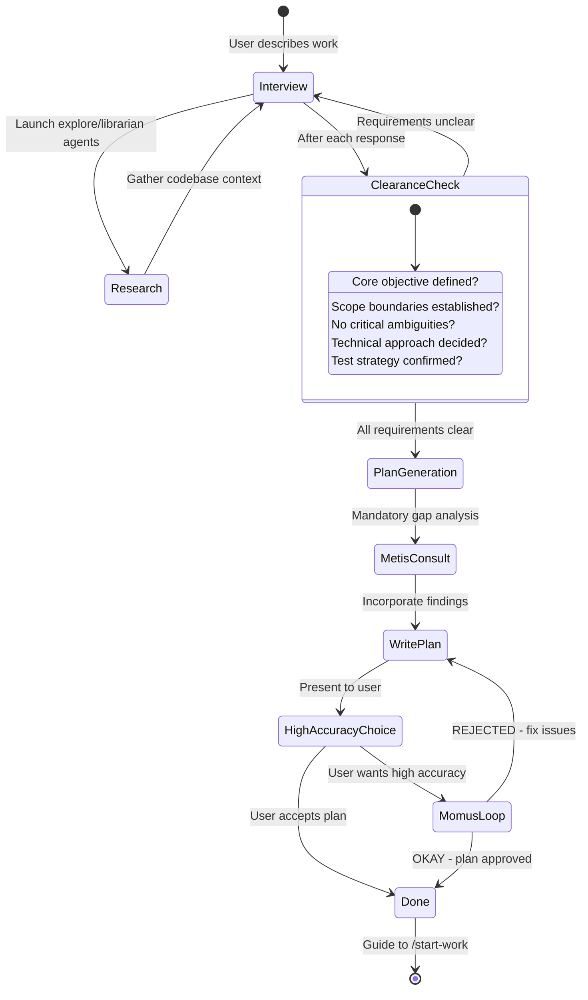
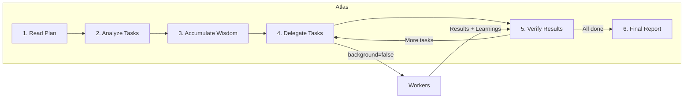

# 오케스트레이션 시스템 가이드

Oh My OpenAgent의 오케스트레이션 시스템은 **계획과 실행의 분리**를 통해 단순한 AI 에이전트를 협업 개발 팀으로 변환합니다.

---

## TL;DR - 언제 무엇을 사용할까

| 복잡도              | 접근 방식                | 사용 시점                                                                                 |
| --------------------- | ------------------------- | ---------------------------------------------------------------------------------------- |
| **단순**            | 그냥 프롬프트            | 단순한 작업, 빠른 수정, 단일 파일 변경                                                    |
| **복잡 + 게으름**    | `ulw` 또는 `ultrawork` 입력 | 컨텍스트 설명이 번거로운 복잡한 작업. 에이전트가 알아서 처리.                              |
| **복잡 + 정밀**     | `@plan` → `/start-work`   | 진정한 오케스트레이션이 필요한 정밀한 다단계 작업. Prometheus가 계획하고, Atlas가 실행.    |

**의사결정 흐름:**

```

Is it a quick fix or simple task?
  └─ YES → Just prompt normally
  └─ NO  → Is explaining the full context tedious?
              └─ YES → Type "ulw" and let the agent figure it out
              └─ NO  → Do you need precise, verifiable execution?
                         └─ YES → Use @plan for Prometheus planning, then /start-work
                         └─ NO  → Just use "ulw"
```

---

## 아키텍처

오케스트레이션 시스템은 전문화와 위임을 통해 컨텍스트 과부하, 인지 드리프트, 검증 갭을 해결하는 3계층 아키텍처를 사용합니다.



위의 모델 라벨은 마케팅 명칭이 아니라 `src/shared/model-requirements.ts`의 현재 폴백 스택을 보여줍니다.

---

## 계획: Prometheus + Metis + Momus

### Prometheus: 당신의 전략 컨설턴트

Prometheus는 단순한 계획자가 아니라, 실제로 무엇이 필요한지 사고하도록 돕는 지능적 인터뷰어입니다. 그는 **READ-ONLY**이며 — `.sisyphus/` 디렉터리 내 마크다운 파일만 생성하거나 수정할 수 있습니다.

**인터뷰 프로세스:**



**의도별 전략:**

Prometheus는 당신이 무엇을 하는지에 따라 인터뷰 스타일을 적응시킵니다.

| 의도                   | Prometheus의 초점               | 예시 질문                                                        |
| ---------------------- | ------------------------------ | ---------------------------------------------------------- |
| **Refactoring**        | 안전성 - 동작 보존              | "어떤 테스트가 현재 동작을 검증하나요?" "롤백 전략은?"      |
| **Build from Scratch** | 발견 - 패턴 우선               | "코드베이스에서 패턴 X를 찾았습니다. 따를까요, 벗어날까요?" |
| **Mid-sized Task**     | 가드레일 - 정확한 경계          | "포함되면 안 되는 것은? 강한 제약은?"                       |
| **Architecture**       | 전략적 - 장기 영향             | "예상 수명? 스케일 요구사항?"                               |

### Metis: 갭 분석가

Prometheus가 계획을 작성하기 전에, Metis가 Prometheus가 놓친 것을 잡아냅니다:

- 사용자 요청에 숨겨진 의도
- 구현을 탈선시킬 수 있는 모호함
- AI-slop 패턴 (과잉 엔지니어링, 스코프 크리프)
- 누락된 수용 기준
- 다루어지지 않은 엣지 케이스

**Metis가 존재하는 이유:**

계획 작성자(Prometheus)는 "ADHD 워킹 메모리"를 가지고 있어 — 페이지에 결코 옮겨지지 않는 연결을 만듭니다. Metis는 암묵적 지식의 외부화를 강제합니다.

### Momus: 무자비한 리뷰어

고정확도 모드에서 Momus는 네 가지 핵심 기준에 대해 계획을 검증합니다:

1. **명확성**: 각 작업이 구현 디테일을 어디서 찾아야 하는지 명시하는가?
2. **검증**: 수용 기준이 구체적이고 측정 가능한가?
3. **컨텍스트**: 추측 10% 이하로 진행할 충분한 컨텍스트가 있는가?
4. **큰 그림**: 목적, 배경, 워크플로가 명확한가?

**Momus 루프:**

Momus는 다음일 때만 "OKAY"라고 말합니다:

- 100%의 파일 참조가 검증됨
- ≥80%의 작업이 명확한 참조 소스를 가짐
- ≥90%의 작업이 구체적인 수용 기준을 가짐
- 비즈니스 로직에 대한 가정을 요구하는 작업이 0
- 결정적 적색 신호(red flag)가 0

REJECT되면, Prometheus는 이슈를 고치고 재제출합니다. 최대 재시도 한도는 없습니다.

---

## 실행: Atlas

### 지휘자 마인드셋

Atlas는 오케스트라 지휘자와 같습니다: 악기를 연주하지 않고 완벽한 화음을 보장합니다.



**Atlas가 할 수 있는 것:**

- 컨텍스트 이해를 위해 파일 읽기
- 결과 검증을 위해 명령 실행
- 에러 점검을 위해 lsp_diagnostics 사용
- grep/glob/ast-grep으로 패턴 검색

**Atlas가 위임해야 하는 것:**

- 코드 파일 작성 또는 편집
- 버그 수정
- 테스트 생성
- Git 커밋

### 지혜 축적

오케스트레이션의 힘은 누적된 학습에 있습니다. 각 작업 후:

1. 서브에이전트의 응답에서 학습 추출
2. 다음으로 카테고리화: 컨벤션, 성공, 실패, 함정, 명령
3. 모든 후속 서브에이전트에게 전달

이는 실수 반복을 방지하고 일관된 패턴을 보장합니다.

**노트패드 시스템:**

```
.sisyphus/notepads/{plan-name}/
├── learnings.md      # Patterns, conventions, successful approaches
├── decisions.md      # Architectural choices and rationales
├── issues.md         # Problems, blockers, gotchas encountered
├── verification.md   # Test results, validation outcomes
└── problems.md       # Unresolved issues, technical debt
```

---

## 워커: Sisyphus-Junior와 전문가들

### Sisyphus-Junior: 작업 실행자

Junior는 실제로 코드를 작성하는 일꾼입니다. 핵심 특성:

- **집중**: 위임할 수 없음 (task 도구 차단됨)
- **규율**: 강박적 todo 추적
- **검증됨**: 완료 전 lsp_diagnostics 통과 필수
- **제약됨**: 계획 파일을 수정할 수 없음 (READ-ONLY)

**왜 폴백 체인으로 충분한가:**

Junior는 가장 똑똑할 필요는 없고 — 신뢰할 수 있어야 합니다. 다음과 함께라면:

1. Atlas의 상세한 프롬프트(50~200라인)
2. 누적되어 전달되는 지혜
3. 명확한 MUST DO / MUST NOT DO 제약
4. 검증 요구사항

하네스가 엄격할 때 중간 티어 실행 모델도 동작합니다. 현재 폴백 순서는 `claude-sonnet-4-6` → `kimi-k2.5` → `gpt-5.4` → `minimax-m2.7` → `big-pickle`입니다. 지능은 단일 워커 모델이 아니라 **시스템**에 있습니다.

### 시스템 리마인더 메커니즘

훅 시스템은 Junior가 중간에 멈추지 않도록 보장합니다:

```
[SYSTEM REMINDER - TODO CONTINUATION]

You have incomplete todos! Complete ALL before responding:
- [ ] Implement user service ← IN PROGRESS
- [ ] Add validation
- [ ] Write tests

DO NOT respond until all todos are marked completed.
```

이 "바위 굴리기" 메커니즘이 시스템이 Sisyphus의 이름을 따게 된 이유입니다.

---

## 카테고리 + 스킬 시스템

### 왜 카테고리가 혁명적인가

**모델 이름의 문제:**

```typescript
// OLD: Model name creates distributional bias
task({ agent: "gpt-5.4", prompt: "..." }); // Model knows its limitations
task({ agent: "claude-opus-4-7", prompt: "..." }); // Different self-perception
```

**해법: 의미적 카테고리:**

```typescript
// NEW: Category describes INTENT, not implementation
task({ category: "ultrabrain", prompt: "..." }); // "Think strategically"
task({ category: "visual-engineering", prompt: "..." }); // "Design beautifully"
task({ category: "quick", prompt: "..." }); // "Just get it done fast"
```

### 빌트인 카테고리

| 카테고리             | 기본 설정                       | 런타임 폴백 순서                                                                       | 사용 시점                                                  |
| -------------------- | ------------------------------- | -------------------------------------------------------------------------------------- | ----------------------------------------------------------- |
| `visual-engineering` | `google/gemini-3.1-pro high`   | `gemini-3.1-pro` → `glm-5` → `claude-opus-4-7` → `glm-5` → `k2p5`                     | 프론트엔드, UI/UX, 디자인, 스타일링, 애니메이션              |
| `ultrabrain`         | `openai/gpt-5.4 xhigh`         | `gpt-5.4` → `gemini-3.1-pro` → `claude-opus-4-7` → `glm-5`                             | 깊은 논리적 추론, 복잡한 아키텍처 결정                       |
| `deep`               | `openai/gpt-5.4 medium`        | `gpt-5.4` → `claude-opus-4-7` → `gemini-3.1-pro`                                       | 목표 지향 자율 문제 해결, 철저한 리서치                      |
| `artistry`           | `google/gemini-3.1-pro high`   | `gemini-3.1-pro` → `claude-opus-4-7` → `gpt-5.4`                                       | 매우 창의적 또는 예술적 작업, 새로운 아이디어                |
| `quick`              | `openai/gpt-5.4-mini`          | `gpt-5.4-mini` → `claude-haiku-4-5` → `gemini-3-flash` → `minimax-m2.7` → `gpt-5-nano` | 사소한 작업, 단일 파일 변경, 오타 수정                       |
| `unspecified-low`    | `anthropic/claude-sonnet-4-6`  | `claude-sonnet-4-6` → `gpt-5.3-codex` → `kimi-k2.5` → `gemini-3-flash` → `minimax-m2.7` | 다른 카테고리에 맞지 않는 작업, 낮은 노력                    |
| `unspecified-high`   | `anthropic/claude-opus-4-7 max` | `claude-opus-4-7` → `gpt-5.4` → `glm-5` → `k2p5` → `kimi-k2.5`                          | 다른 카테고리에 맞지 않는 작업, 높은 노력                    |
| `writing`            | `kimi-for-coding/k2p5`         | `gemini-3-flash` → `kimi-k2.5` → `claude-sonnet-4-6` → `minimax-m2.7`                  | 문서, 산문, 기술 문서 작성                                   |

### 스킬: 도메인별 지시

스킬은 서브에이전트 프롬프트에 전문 지시를 prepend합니다:

```typescript
// Category + Skill combination
task(
  (category = "visual-engineering"),
  (load_skills = ["frontend-ui-ux"]), // Adds UI/UX expertise
  (prompt = "..."),
);

task(
  (category = "deep"),
  (load_skills = ["playwright"]), // Adds browser automation expertise
  (prompt = "..."),
);
```

---

## 사용 패턴

### Prometheus 호출 방법

**방법 1: Prometheus 에이전트로 전환 (Tab → Prometheus 선택)**

```
1. 프롬프트에서 Tab을 누름
2. 에이전트 목록에서 "Prometheus"를 선택
3. 작업 설명: "I want to refactor the auth system"
4. 인터뷰 질문에 답함
5. Prometheus가 .sisyphus/plans/{name}.md에 계획 생성
```

**방법 2: @plan 명령 사용 (Sisyphus 내에서)**

```
1. Sisyphus(기본 에이전트)에 머무름
2. 입력: @plan "I want to refactor the auth system"
3. @plan 명령이 자동으로 Prometheus로 전환
4. 인터뷰 질문에 답함
5. Prometheus가 .sisyphus/plans/{name}.md에 계획 생성
```

**어느 것을 사용해야 할까?**

| 시나리오                          | 권장 방법                  | 이유                                                  |
| --------------------------------- | -------------------------- | ---------------------------------------------------- |
| **새 세션, 새로 시작**            | Prometheus 에이전트로 전환 | 명확한 멘탈 모델 - "계획 모드"에 들어감              |
| **이미 Sisyphus, 작업 중**        | @plan 사용                 | 편리, 에이전트 전환 불필요                            |
| **명시적 제어 원함**              | Prometheus 에이전트로 전환 | 계획 vs 실행 컨텍스트의 명확한 분리                   |
| **빠른 계획 인터럽트**            | @plan 사용                 | 현재 컨텍스트에서 가장 빠른 경로                      |

두 방법 모두 같은 Prometheus 계획 흐름을 트리거합니다. @plan 명령은 그저 편의 단축키입니다.

### /start-work 동작과 세션 연속성

**/start-work 실행 시 발생하는 일:**

```
User: /start-work
    ↓
[start-work hook activates]
    ↓
Check: Does .sisyphus/boulder.json exist?
    ↓
    ├─ YES (existing work) → RESUME MODE
    │   - Read the existing boulder state
    │   - Calculate progress (checked vs unchecked boxes)
    │   - Inject continuation prompt with remaining tasks
    │   - Atlas continues where you left off
    │
    └─ NO (fresh start) → INIT MODE
        - Find the most recent plan in .sisyphus/plans/
        - Create new boulder.json tracking this plan
        - Switch session agent to Atlas
        - Begin execution from task 1
```

**세션 연속성 설명:**

`boulder.json` 파일은 다음을 추적합니다:

- **active_plan**: 현재 계획 파일 경로
- **session_ids**: 이 계획에 대해 작업한 모든 세션
- **started_at**: 작업이 시작된 시점
- **plan_name**: 사람이 읽을 수 있는 계획 식별자

**예시 타임라인:**

```
Monday 9:00 AM
  └─ @plan "Build user authentication"
  └─ Prometheus interviews and creates plan
  └─ User: /start-work
  └─ Atlas begins execution, creates boulder.json
  └─ Task 1 complete, Task 2 in progress...
  └─ [Session ends - computer crash, user logout, etc.]

Monday 2:00 PM (NEW SESSION)
  └─ User opens new session (agent = Sisyphus by default)
  └─ User: /start-work
  └─ [start-work hook reads boulder.json]
  └─ "Resuming 'Build user authentication' - 3 of 8 tasks complete"
  └─ Atlas continues from Task 3 (no context lost)
```

`/start-work`를 실행하면 Atlas가 자동으로 활성화됩니다. Atlas로 수동 전환할 필요가 없습니다.

### Hephaestus vs Sisyphus + ultrawork

**빠른 비교:**

| 측면            | Hephaestus                                 | Sisyphus + `ulw` / `ultrawork`                       |
| --------------- | ------------------------------------------ | ---------------------------------------------------- |
| **모델**         | `gpt-5.4` (`medium`)                       | 설정에 따라 `claude-opus-4-7` / `kimi-k2.5` / `gpt-5.4` / `glm-5` |
| **접근 방식**    | 자율적 깊이 작업자                          | 키워드 활성화 ultrawork 모드                          |
| **최적**         | 복잡한 아키텍처 작업, 깊은 추론             | 일반적 복잡 작업, "그냥 해줘" 시나리오                |
| **계획**         | 실행 중 자체 계획                           | 가능한 경우 Prometheus 계획 사용                      |
| **위임**         | explore/librarian 에이전트의 적극적 사용     | 카테고리 기반 위임 사용                               |
| **온도**         | 0.1                                        | 0.1                                                  |

**Hephaestus를 사용해야 하는 시점:**

다음일 때 Hephaestus로 전환(Tab → Hephaestus 선택)하세요:

1. **깊은 아키텍처 추론이 필요할 때**
   - "Design a new plugin system"
   - "Refactor this monolith into microservices"

2. **추론 체인을 요구하는 복잡한 디버깅**
   - "Why does this race condition only happen on Tuesdays?"
   - "Trace this memory leak through 15 files"

3. **도메인 간 지식 합성**
   - "Integrate our Rust core with the TypeScript frontend"
   - "Migrate from MongoDB to PostgreSQL with zero downtime"

4. **GPT-5.4 추론을 특정해서 원할 때**
   - 일부 문제는 GPT-5.4의 훈련 특성으로부터 이득을 봅니다

**Sisyphus + `ulw`를 사용해야 하는 시점:**

다음일 때 Sisyphus에서 `ulw` 키워드를 사용하세요:

1. **에이전트가 알아서 처리하길 원할 때**
   - "ulw fix the failing tests"
   - "ulw add input validation to the API"

2. **복잡하지만 잘 스코프된 작업**
   - "ulw implement JWT authentication following our patterns"
   - "ulw create a new CLI command for deployments"

3. **게으름을 느낄 때** (공식적으로 지원되는 사용 사례)
   - 상세한 요구사항을 작성하고 싶지 않음
   - 에이전트가 탐색하고 결정하는 것을 신뢰

4. **기존 계획을 활용하고 싶을 때**
   - Prometheus 계획이 존재하면 `ulw` 모드가 사용 가능
   - 계획이 없으면 자율 탐색으로 폴백

**권장:**

- **대부분의 사용자에게**: Sisyphus에서 `ulw` 키워드를 사용하세요. 이는 기본 경로이고 복잡한 작업의 90%에서 훌륭하게 동작합니다.
- **파워 유저에게**: GPT-5.4의 추론 스타일이 특정해서 필요하거나 자율적 탐색과 실행의 "AmpCode 깊이 모드" 경험을 원할 때 Hephaestus로 전환하세요.

---

## 설정

`oh-my-openagent.json`에서 관련 기능을 제어할 수 있습니다:

```jsonc
{
  "sisyphus_agent": {
    "disabled": false, // Enable Atlas orchestration (default: false)
    "planner_enabled": true, // Enable Prometheus (default: true)
    "replace_plan": true, // Replace default plan agent with Prometheus (default: true)
  },

  // Hook settings (add to disable)
  "disabled_hooks": [
    // "start-work",             // Disable execution trigger
    // "prometheus-md-only"      // Remove Prometheus write restrictions (not recommended)
  ],
}
```

---

## 트러블슈팅

### "Prometheus로 전환했는데 아무 일도 일어나지 않아요"

Prometheus는 기본적으로 인터뷰 모드에 진입합니다. 요구사항에 대해 질문할 것입니다. 답하고 준비되면 "make it a plan"이라고 말하세요.

### "/start-work가 'no active plan found'라고 합니다"

다음 중 하나입니다:

- `.sisyphus/plans/`에 계획이 존재하지 않음 → 먼저 Prometheus로 계획을 만드세요
- 계획이 존재하지만 boulder.json이 다른 곳을 가리킴 → `.sisyphus/boulder.json`을 삭제하고 재시도

### "Atlas에 있는데 일반 모드로 다시 전환하고 싶어요"

`exit`를 입력하거나 새 세션을 시작하세요. Atlas는 주로 `/start-work`를 통해 진입합니다 — 일반적으로 "Atlas로 전환"을 수동으로 하지 않습니다.

### "@plan과 단순히 Prometheus로 전환하는 것의 차이는 뭔가요?"

**기능적으로는 없습니다.** 둘 다 Prometheus를 호출합니다. @plan은 편의 명령이고 에이전트 전환은 명시적 제어입니다. 자연스러운 쪽을 사용하세요.

### "Hephaestus를 사용해야 할까요, ulw를 입력해야 할까요?"

**대부분의 작업**: Sisyphus에서 `ulw`를 입력하세요.

**Hephaestus 사용**: 깊은 아키텍처 작업이나 복잡한 디버깅을 위해 GPT-5.4의 추론 스타일이 특정해서 필요할 때.

---

## 더 읽기

- [개요](./overview.md)
- [기능 레퍼런스](../reference/features.md)
- [설정 레퍼런스](../reference/configuration.md)
- [매니페스토](../manifesto.md)
