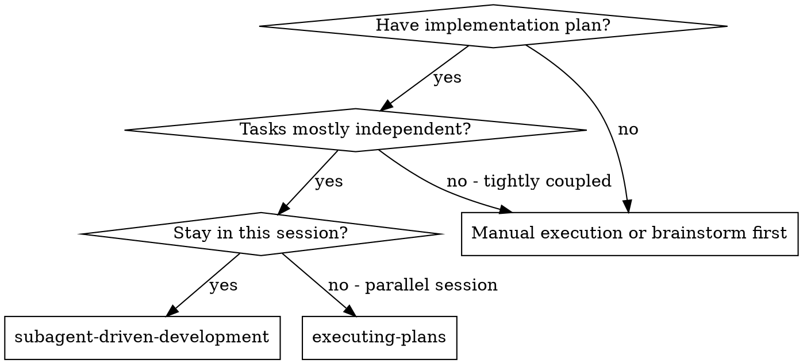
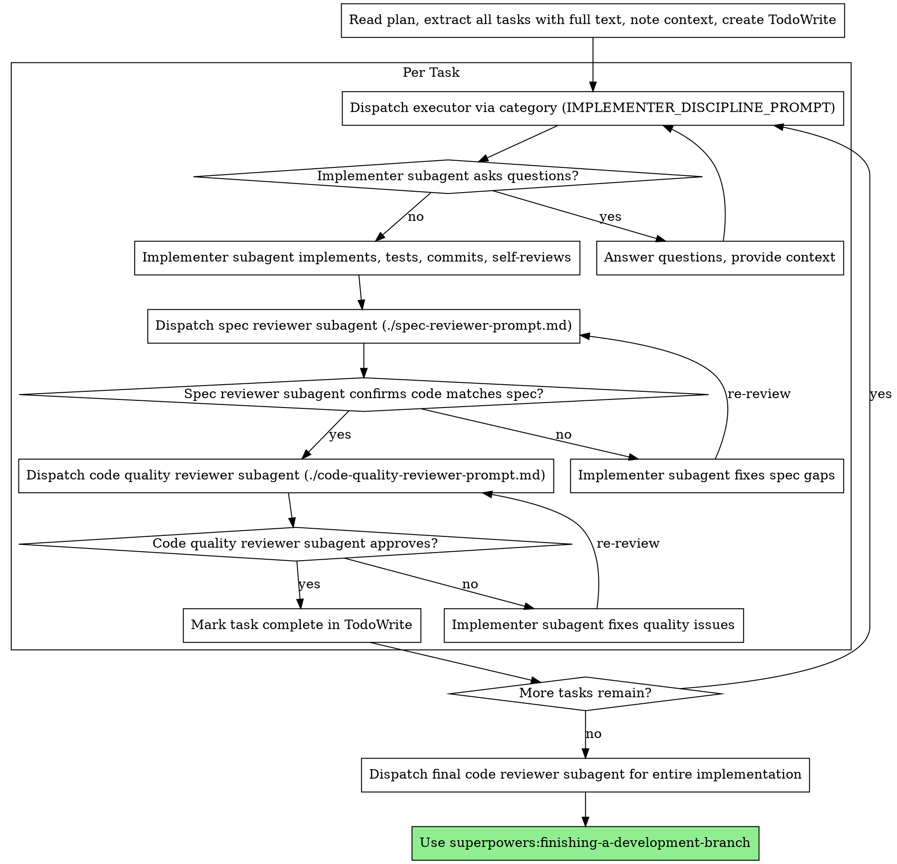

# Subagent-Driven Development

Execute plan by dispatching fresh subagent per task, with two-stage review after each: spec compliance review first, then code quality review.

**Core principle:** Fresh subagent per task + two-stage review (spec then quality) = high quality, fast iteration

## When to Use



**vs. Executing Plans (parallel session):**
- Same session (no context switch)
- Fresh subagent per task (no context pollution)
- Two-stage review after each task: spec compliance first, then code quality
- Faster iteration (no human-in-loop between tasks)

## The Process



## Prompt Templates

- `delegate_task(category="ultrabrain")` - Dispatch executor with IMPLEMENTER_DISCIPLINE_PROMPT
- `./spec-reviewer-prompt.md` - Dispatch spec compliance reviewer subagent
- `./code-quality-reviewer-prompt.md` - Dispatch code quality reviewer subagent

## Example Workflow

```
You: I'm using Subagent-Driven Development to execute this plan.

[Read plan file once: docs/plans/feature-plan.md]
[Extract all 5 tasks with full text and context]
[Create TodoWrite with all tasks]

Task 1: Hook installation script

[Get Task 1 text and context (already extracted)]
[Dispatch implementation subagent with full task text + context]

Implementer: "Before I begin - should the hook be installed at user or system level?"

You: "User level (~/.config/superpowers/hooks/)"

Implementer: "Got it. Implementing now..."
[Later] Implementer:
  - Implemented install-hook command
  - Added tests, 5/5 passing
  - Self-review: Found I missed --force flag, added it
  - Committed

[Dispatch spec compliance reviewer]
Spec reviewer: ✅ Spec compliant - all requirements met, nothing extra

[Get git SHAs, dispatch code quality reviewer]
Code reviewer: Strengths: Good test coverage, clean. Issues: None. Approved.

[Mark Task 1 complete]

Task 2: Recovery modes

[Get Task 2 text and context (already extracted)]
[Dispatch implementation subagent with full task text + context]

Implementer: [No questions, proceeds]
Implementer:
  - Added verify/repair modes
  - 8/8 tests passing
  - Self-review: All good
  - Committed

[Dispatch spec compliance reviewer]
Spec reviewer: ❌ Issues:
  - Missing: Progress reporting (spec says "report every 100 items")
  - Extra: Added --json flag (not requested)

[Implementer fixes issues]
Implementer: Removed --json flag, added progress reporting

[Spec reviewer reviews again]
Spec reviewer: ✅ Spec compliant now

[Dispatch code quality reviewer]
Code reviewer: Strengths: Solid. Issues (Important): Magic number (100)

[Implementer fixes]
Implementer: Extracted PROGRESS_INTERVAL constant

[Code reviewer reviews again]
Code reviewer: ✅ Approved

[Mark Task 2 complete]

...

[After all tasks]
[Dispatch final code-reviewer]
Final reviewer: All requirements met, ready to merge

Done!
```

## Advantages

**vs. Manual execution:**
- Subagents follow TDD naturally
- Fresh context per task (no confusion)
- Parallel-safe (subagents don't interfere)
- Subagent can ask questions (before AND during work)

**vs. Executing Plans:**
- Same session (no handoff)
- Continuous progress (no waiting)
- Review checkpoints automatic

**Efficiency gains:**
- No file reading overhead (controller provides full text)
- Controller curates exactly what context is needed
- Subagent gets complete information upfront
- Questions surfaced before work begins (not after)

**Quality gates:**
- Self-review catches issues before handoff
- Two-stage review: spec compliance, then code quality
- Review loops ensure fixes actually work
- Spec compliance prevents over/under-building
- Code quality ensures implementation is well-built

**Cost:**
- More subagent invocations (executor + 2 reviewers per task)
- Controller does more prep work (extracting all tasks upfront)
- Review loops add iterations
- But catches issues early (cheaper than debugging later)

## Red Flags

**Never:**
- Skip reviews (spec compliance OR code quality)
- Proceed with unfixed issues
- Dispatch multiple implementation subagents in parallel (conflicts)
- Make subagent read plan file (provide full text instead)
- Skip scene-setting context (subagent needs to understand where task fits)
- Ignore subagent questions (answer before letting them proceed)
- Accept "close enough" on spec compliance (spec reviewer found issues = not done)
- Skip review loops (reviewer found issues = executor fixes = review again)
- Let executor self-review replace actual review (both are needed)
- **Start code quality review before spec compliance is ✅** (wrong order)
- Move to next task while either review has open issues

**If subagent asks questions:**
- Answer clearly and completely
- Provide additional context if needed
- Don't rush them into implementation

**If reviewer finds issues:**
- Implementer (same subagent) fixes them
- Reviewer reviews again
- Repeat until approved
- Don't skip the re-review

**If subagent fails task:**
- Dispatch fix subagent with specific instructions
- Don't try to fix manually (context pollution)

## Integration

**Required workflow skills:**
- **superpowers:writing-plans** - Creates the plan this skill executes
- **superpowers:requesting-code-review** - Code review template for reviewer subagents
- **superpowers:finishing-a-development-branch** - Complete development after all tasks

**Subagents should use:**
- **superpowers:test-driven-development** - Subagents follow TDD for each task

**Alternative workflow:**
- **superpowers:executing-plans** - Use for parallel session instead of same-session execution

---

## Codex 协作规范 (via collaborating-with-codex skill)

保留原版三阶段评审流程，在各阶段添加 Codex 辅助：

| 阶段 | Codex 协作要求 |
|------|----------------|
| **Implementer 实现** | **必须**: 调用 `skill("collaborating-with-codex")` 索要代码原型 (unified diff)，以此为参考重写 |
| **Spec Review** | **必须**: 调用 Codex 审查 task -> diff 范围，检查遗漏/越界 |
| **Quality Review** | **可选**: 调用 Codex 检查代码质量、风格、潜在 bug |

**Codex 调用规范:**

1. **阶段 1 (Implementer 实现)**: 
   - 调用 `skill("collaborating-with-codex")` 获取 unified diff 原型
   - 限定范围为当前任务相关文件
   - 不允许实际修改

2. **阶段 2 (Spec Review)**:
   - 用 Codex 审查变更是否完全符合任务
   - 检查是否遗漏 acceptance criteria

3. **阶段 3 (Quality Review)**:
   - 用 Codex 评估代码质量、潜在 bug
   - 提供 refactor 建议 (可选)

---

## Codex 协作提示词模板

### Implementer 阶段 (原型生成)

```
PROMPT:
你是代码实现助手。

请阅读任务描述并给出最小可行的代码实现原型（unified diff）。
你不能直接修改文件，只能给 diff。

任务描述:
{task_description}

约束:
- 输出必须是 unified diff
- 不要解释
- 仅包含必要修改
```

### Spec Review 阶段

```
PROMPT:
你是规范检查员。

请检查以下变更是否完全满足任务要求。
列出遗漏点和超出范围的内容。

任务:
{task_description}

变更:
{diff}
```

### Quality Review 阶段

```
PROMPT:
你是代码质量审查员。

请审查以下代码是否存在 bug、潜在性能问题或可读性问题。
列出必须修复和建议优化。

变更:
{diff}
```

---

## Manus Principles

### Subagent Discovery Recording

When subagents discover important information during implementation:

1. **Record to findings.md**: Subagent discoveries, API quirks, pattern insights
2. **Record to progress.md**: Task completion status, errors encountered

### Controller Responsibility

The controller (you) must:
- Update `progress.md` after each task completion
- Aggregate subagent discoveries into `findings.md`
- Log any BLOCKED responses with full context

### 3-Strike Protocol for Subagents

If an executor subagent fails 3 times on the same task:

1. **STOP** dispatching more fix subagents
2. **Document** failure in `progress.md`
3. **Escalate** to human for architectural discussion

**Do NOT:** Dispatch a 4th subagent hoping for different results.
