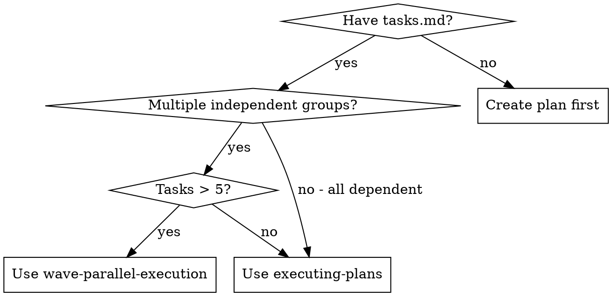

# Wave-Parallel Execution

## Overview

执行包含多个独立 Wave 的计划，Wave 间并行，Wave 内串行。每个任务由 Implementer agent 执行。

**Core principle:** 最大化并行效率，同时保持任务依赖顺序。Implementer agent 处理每个任务。

**Announce at start:** "I'm using the wave-parallel-execution skill to execute this plan in parallel waves."

## When to Use

- tasks.md 有多个可并行的任务组
- 任务间有明确的依赖关系
- 需要最大化并行效率
- 任务数量 > 5 个

## When NOT to Use

- 任务数量 ≤ 5 个（使用 executing-plans）
- 所有任务都有依赖关系（无法并行）
- 简单顺序执行即可完成



## The Process

### Step 1: Wave 分组计算

1. **读取 tasks.md**
   - 解析任务列表和依赖关系
   - 检测文件冲突

2. **调用 wave-grouper**
   ```typescript
   import { parseTasksMd, groupTasksIntoWaves } from "src/shared"
   
   const result = parseTasksMd(tasksContent)
   const { waves, conflicts } = result.waveResult
   ```

3. **检查 Wave 数量**
   
   **IF waves.length === 1:**
   → 显示: "只有 1 个 Wave，降级为 Sequential 模式"
   → **REQUIRED SUB-SKILL:** Use superpowers:executing-plans
   → RETURN

4. **更新 tasks.md 添加 Wave 注释**
   - 在每个任务标题后添加 `<!-- Wave: N -->`
   - 显示 Wave Preview 表格

### Step 2: 创建多个 Worktrees

For each Wave:

1. **调用 using-git-worktrees skill**
   - **REQUIRED SUB-SKILL:** Use superpowers:using-git-worktrees
   - 创建 worktree: `feature/{change-name}-wave{N}`
   - 例如: `feature/auth-system-wave0`, `feature/auth-system-wave1`

2. **记录 worktree 信息**
   ```json
   {
     "waves": {
       "0": {
         "branch": "feature/{name}-wave0",
         "worktreePath": ".worktrees/feature-{name}-wave0",
         "status": "ready"
       }
     }
   }
   ```

### Step 3: 并行调度 Waves (使用适当的 Agent)

**Executor Selection Logic (MANDATORY):**

在调度每个 Wave 之前，根据任务类型选择适当的 agent：

| 任务类型 | 文件扩展名 / 关键词 | Agent | Skills |
|----------|---------------------|-------|--------|
| **文档** | `.md`, `.rst`, `.txt`, `.adoc`, README, docs/, CHANGELOG | `document-writer` | [] |
| **视觉/UI** | `.tsx`, `.jsx`, `.vue`, `.css` + 样式关键词 | `frontend-ui-ux-engineer` | ["frontend-ui-ux"] |
| **代码** | `.ts`, `.js`, `.py` 等 (逻辑, API, 后端) | `implementer` | ["test-driven-development", "codex-mcp-collaboration"] |

**分类决策树:**

```
任务是关于文档文件 (.md, .rst, docs/) 吗?
  是 → document-writer
  否 → 任务是关于视觉/样式变更吗?
         是 → frontend-ui-ux-engineer
         否 → implementer (默认)
```

**Wave 内混合任务类型:**

如果一个 Wave 包含多种类型的任务，按任务类型分组并分别调度：

```typescript
// 对 Wave 内的任务按类型分组
const docTasks = wave.tasks.filter(t => isDocTask(t))
const visualTasks = wave.tasks.filter(t => isVisualTask(t))
const codeTasks = wave.tasks.filter(t => !isDocTask(t) && !isVisualTask(t))

// 并行调度不同类型
if (docTasks.length > 0) {
  sisyphus_task({ subagent_type: "document-writer", ... })
}
if (visualTasks.length > 0) {
  sisyphus_task({ subagent_type: "frontend-ui-ux-engineer", ... })
}
if (codeTasks.length > 0) {
  sisyphus_task({ subagent_type: "implementer", ... })
}
```

#### Wave Prompt 最佳实践

参考 **dispatching-parallel-agents** skill 的原则，每个 Wave prompt 必须满足：

| 原则 | 说明 | Wave 中的应用 |
|------|------|---------------|
| **Focused** | 一个明确的问题域 | 每个 Wave prompt 只包含该 Wave 的任务 |
| **Self-contained** | 包含理解问题所需的全部上下文 | 包含 worktree 路径、任务详情、acceptance criteria |
| **Specific output** | 明确返回格式 | 使用 WAVE_COMPLETED / WAVE_BLOCKED 协议 |
| **Constraints** | 明确限制 | MUST DO / MUST NOT DO 列表 |

For each Wave (并行 dispatch):

1. **并行 dispatch Implementer agents**

   ```typescript
   // 并行启动所有 Waves
   for (const wave of waves) {
     sisyphus_task({
       subagent_type: "implementer",
       description: `Execute Wave ${wave.id} tasks`,
       skills: ["test-driven-development", "codex-mcp-collaboration"],
       run_in_background: true,
       prompt: `
## Wave ${wave.id} Execution

You are executing Wave ${wave.id} in worktree: ${wave.worktreePath}

### Tasks in this Wave

${wave.tasks.map(t => `
#### Task ${t.id}: ${t.name}

**Risk Tier:** ${t.riskTier}

**Description:**
${t.fullText}

**Files:**
- Create: ${t.filesToCreate}
- Modify: ${t.filesToModify}
- Test: ${t.testFiles}

**Acceptance Criteria:**
${t.acceptanceCriteria}
`).join('\n')}

### Instructions

For each task in order:
1. Implement following your standard workflow (Codex prototype → TDD → Codex review)
2. Commit after each task with message: "checkpoint: Task {id}: {description}"
3. Record SHA for each completed task

### MUST DO
- Execute tasks in order within this Wave
- Use Bun for tests
- Run lsp_diagnostics before each commit
- Request Codex prototype before coding
- Request Codex review after coding

### MUST NOT DO
- Do not modify files outside the listed paths
- Do not skip TDD for Tier 2/3 tasks
- Do not suppress type errors

### Report Format

When all tasks complete:
WAVE_COMPLETED:
- Wave: ${wave.id}
- Tasks: [list with SHAs]
- Notes: [any concerns]

If blocked on any task:
WAVE_BLOCKED:
- Wave: ${wave.id}
- Blocked at: Task {id}
- Reason: [why blocked]
- Completed: [list of completed tasks with SHAs]

Work from: ${wave.worktreePath}
`
     })
   }
   ```

2. **等待所有 Waves 完成**
   - 使用 `background_output` 收集结果
   - 记录每个 Wave 的完成状态和 SHAs

3. **处理 Wave 结果**

   | Response | Action |
   |----------|--------|
   | `WAVE_COMPLETED` | Record all SHAs, mark Wave complete |
   | `WAVE_BLOCKED` | Note completed tasks, report blocker to user |

### Step 3b: 验证并行结果

参考 **dispatching-parallel-agents** 的验证流程：

1. **Review each summary** - 理解每个 Wave 做了什么
   ```typescript
   for (const result of results) {
     console.log(`Wave ${result.waveId}: ${result.tasks.length} tasks completed`)
     result.tasks.forEach(t => console.log(`  - ${t.id}: ${t.sha}`))
   }
   ```

2. **Check for conflicts** - 检查是否有意外的文件冲突
   ```bash
   git diff --name-only feature/{name}-wave0..feature/{name}-wave1
   ```

3. **Run full suite** - 合并前在每个 worktree 运行测试
   ```bash
   for wave in waves:
     cd .worktrees/feature-{name}-wave{wave.id}
     bun test
   ```

4. **Spot check** - 抽查关键变更，agents 可能有系统性错误

### Step 4: 合并清理

1. **调用 finishing-a-development-branch skill**
   - **REQUIRED SUB-SKILL:** Use superpowers:finishing-a-development-branch
   - 按 Wave 编号顺序合并所有分支
   - 处理合并冲突（如有）

2. **调用 archiving-changes skill**
   - **REQUIRED SUB-SKILL:** Use superpowers:archiving-changes
   - 清理所有 wave worktrees
   - 归档变更文档

## Error Handling

### Wave 执行失败

1. **单个 Wave 失败 (WAVE_BLOCKED)**
   - 停止该 Wave
   - 其他 Waves 继续执行
   - 报告失败详情
   - 等待反馈后重试或跳过

2. **多个 Waves 失败**
   - 停止所有 Waves
   - 显示所有失败详情
   - 等待反馈

### 合并冲突

1. 按 Wave 顺序逐个合并
2. 冲突时停止并提示用户
3. 用户解决后继续

## Common Mistakes

参考 **dispatching-parallel-agents** 的常见错误，适配 Wave 场景：

**❌ Wave 粒度过大:** 单个 Wave 包含 10+ 任务 - agent 容易迷失
**✅ 正确:** 每个 Wave 2-5 个任务

**❌ Prompt 太宽泛:** "Execute all tasks in this wave" - agent 不知道具体做什么
**✅ 具体:** 列出每个任务的 ID、文件、acceptance criteria

**❌ 忽略文件冲突:** 多个 Wave 修改同一文件
**✅ 正确:** wave-grouper 自动检测冲突并添加依赖

**❌ 跳过结果验证:** 假设所有 Wave 成功就直接合并
**✅ 正确:** 检查每个 WAVE_COMPLETED 的 SHA 列表，运行完整测试

**❌ 并行合并:** 同时合并多个 wave 分支
**✅ 正确:** 按 Wave 编号顺序串行合并

**❌ 输出格式不明确:** Agent 返回自由文本，难以解析
**✅ 具体:** 强制使用 WAVE_COMPLETED / WAVE_BLOCKED 协议

## Integration

- **REQUIRED SUB-SKILL:** using-git-worktrees
- **REQUIRED SUB-SKILL:** finishing-a-development-branch
- **REQUIRED SUB-SKILL:** archiving-changes
- **DESIGN REFERENCE:** dispatching-parallel-agents (并行调用最佳实践)

**Note:** 不再直接依赖 subagent-driven-development skill，而是直接使用 Implementer agent。

## Implementer Agent Workflow (Internal)

每个 Implementer agent 内部遵循以下流程：

```
Step 1: Understand Task → QUESTIONS if unclear
Step 2: Codex Phase 2 - Get prototype (read-only)
Step 3: TDD Implementation (Tier-based)
Step 4: Codex Phase 3 - Review
Step 5: Commit + Report
```

## Remember

- 先计算 Wave 分组，再创建 worktrees
- 单 Wave 时自动降级为 executing-plans
- Wave 间并行，Wave 内串行
- 使用 Implementer agent 执行每个任务
- 按 Wave 编号顺序合并
- 保留所有 checkpoint SHAs
- 错误时优雅降级

## Key Benefits

参考 **dispatching-parallel-agents** 的核心优势，Wave 模式提供：

1. **Parallelization** - 多个 Waves 同时执行，N 个 Wave 的工作在 1 个 Wave 的时间内完成
2. **Focus** - 每个 Wave agent 只关注该 Wave 的任务，上下文更清晰
3. **Isolation** - Git Worktree 隔离，避免文件冲突
4. **Speed** - 10 个任务分 3 个 Wave，比串行快 3 倍

## Real Example

**场景:** 实现认证系统，tasks.md 包含 8 个任务

**Wave 分组结果:**
- Wave 0: Task 1.1 (User model), Task 1.2 (Session model) - 独立数据模型
- Wave 1: Task 2.1 (Login API), Task 2.2 (Register API) - 独立 API 端点
- Wave 2: Task 3.1 (Auth middleware) - 依赖 Wave 0+1

**Dispatch:**
```
Wave 0 agent → .worktrees/feature-auth-wave0 → 2 tasks 并行
Wave 1 agent → .worktrees/feature-auth-wave1 → 2 tasks 并行
[等待 Wave 0+1 完成]
Wave 2 agent → .worktrees/feature-auth-wave2 → 1 task
```

**结果:**
- Wave 0: WAVE_COMPLETED, 2 tasks, SHAs: abc123, def456
- Wave 1: WAVE_COMPLETED, 2 tasks, SHAs: ghi789, jkl012
- Wave 2: WAVE_COMPLETED, 1 task, SHA: mno345

**时间节省:** 5 个并行化任务 = 串行时间的 ~40%

## 下一步

所有 Waves 完成后：

1. **REQUIRED SUB-SKILL:** Use superpowers:finishing-a-development-branch
2. 完成后运行 `/archive {change-name}` 归档变更
3. **REQUIRED SUB-SKILL:** Use superpowers:archiving-changes
